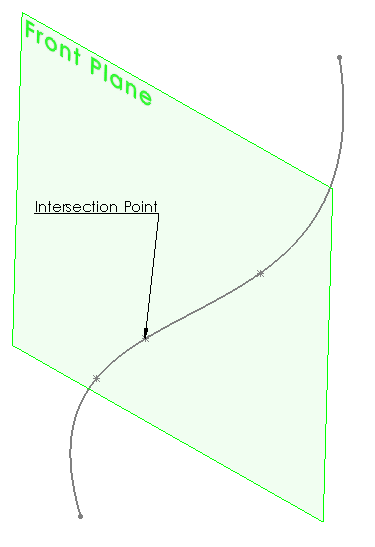

{ width=300 }

This example demonstrates how to find the intersection points between selected surface (plane or face) with curve (edge or sketch segment) using SOLIDWORKS API.

* Open Part document
* Select plane or any face as first selection object
* Select sketch segment (line, spline or arc) as second selection object
* Run the macro. As the result the 3D Sketch is created with points of intersection between selected objects

[ISurface::IntersectCurve2](http://help.solidworks.com/2018/english/api/sldworksapi/solidworks.interop.sldworks~solidworks.interop.sldworks.isurface~intersectcurve2.html) SOLIDWORKS API method is used to find the intersection points within the specified boundaries of curve and surface.


