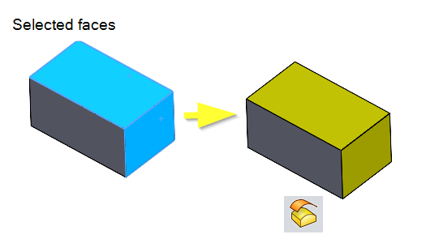

{ width=525 }

This VBA macro creates a new surface feature from selected faces in a part file. Thus duplicating the selected surfaces and giving it a predefined color.
This can be usefull if you want to reuse existing surfaces and don't want to consolidate existing ones.

Steps to take

* A part file must be the active document.
* You have to select at least one face.
* If you select other types of entities, they will be filtered out.
* Run the macro. As the result a Surface Offset is created of the selected faces with distance 0
* This feature will get a yellow color by default, but you can change the RGB color to set another one.

Author: [Eddy Alleman](https://www.linkedin.com/in/eddyalleman/) ([EDAL Solutions](www.edalsolutions.be))



