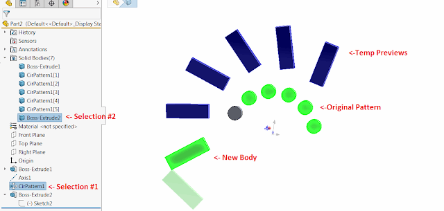

This SOLIDWORKS API example reads the transform of the selected circular pattern and creates a temp preview of the pattern of the specified seed body by applying the same transform as in the circular pattern.

{ width=640 height=304 }

* Select circular pattern feature as a first selected object
  * It must use reference axis as the directionSelect any solid body which is not a part of the circular pattern feature
* Run the macro. Macro will read the transformation from the pattern and apply the same transformation to the body selected in previous step.
The preview will be displayed using temporarily bodies which will be destroyed immediately when macro resumes execution (i.e. F5 or run).
* There won't be any temp features created or removed during the run of this macro


