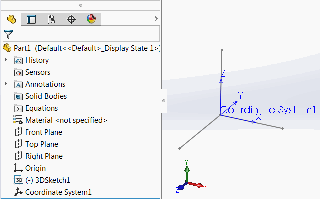
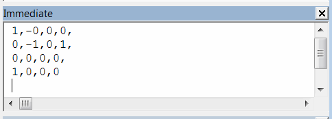

{ width=450 }

This VBA macro extract the 4x4 [transformation matrix](/solidworks-api/geometry/transformation/) from the selected coordinate system in the feature manager tree.

The comma separated results are output to the immediate (ctrl+G) window of VBA editor.

{ width=350 }


