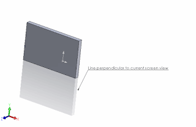

This example demonstrates how to draw a sketch line which is perpendicular (normal) to the current view orientation relative to the screen using SOLIDWORKS API.

The line will start at the point at the middle of the screen and will be perpendicular to the screen orientation. That means that initially it will be rendered as point until view rotates.

[IModelView::Transform](http://help.solidworks.com/2018/english/api/sldworksapi/solidworks.interop.sldworks~solidworks.interop.sldworks.imodelview~transform.html) SOLIDWORKS API property is used to extract the transformation matrix of current orientation of the view.

{ width=320 height=208 }


