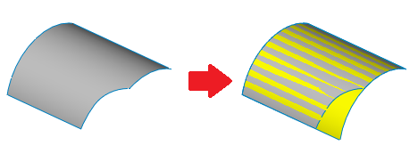

This VBA example restores the surface of the selected face by performing the untrim operation.

This command is similar to the *Untrim Surface* feature in the Feature Manager, but it performs the operation using temporary bodies instead of features.

Copied surface used in operations is infinite and needs to be trimmed in order to form a face. Required boundary is calculated by evaluating the maximum and minimum values of the UV of the input face.

{ width=450 }

Iso curves are used to extract the curve at the specified boundary UV of the face. The calculated curve is infinite and needs to be trimmed in the corners to form the closed loop before the surface can be trimmed and converted into the body.

Select any face and run the macro. The resulting surface is displayed in the graphics area and macro stops execution. Once continued - the preview is hidden.

{ width=450 }


