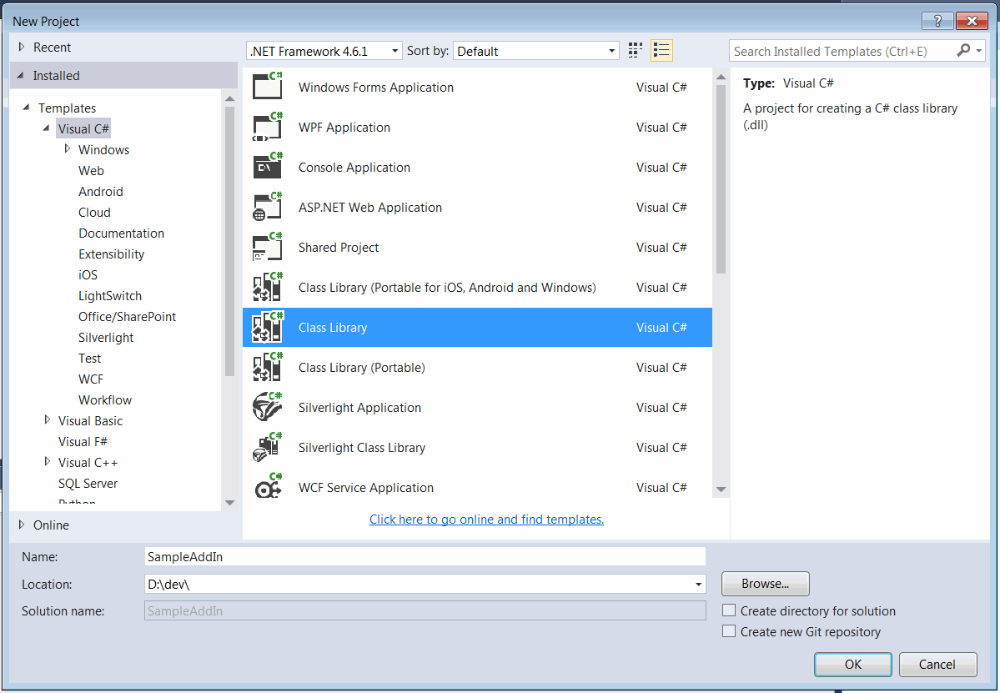
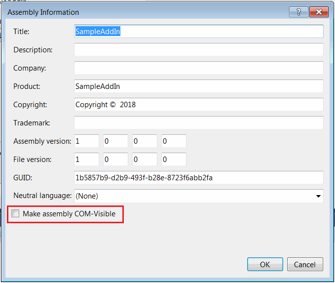
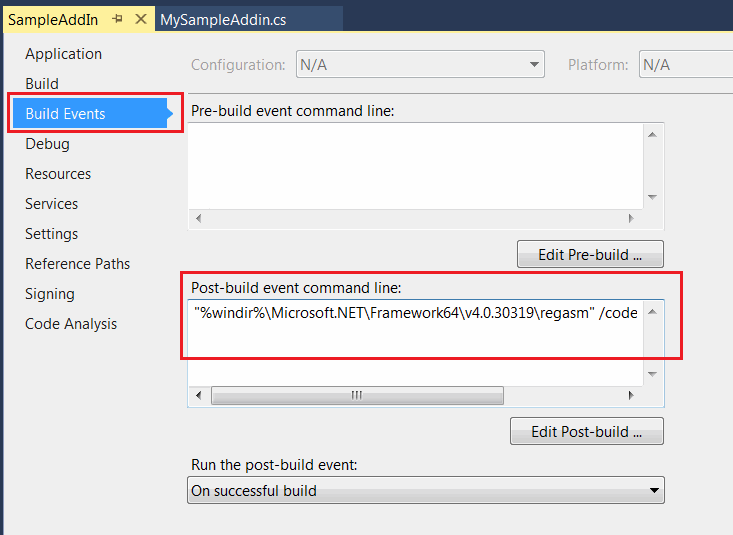
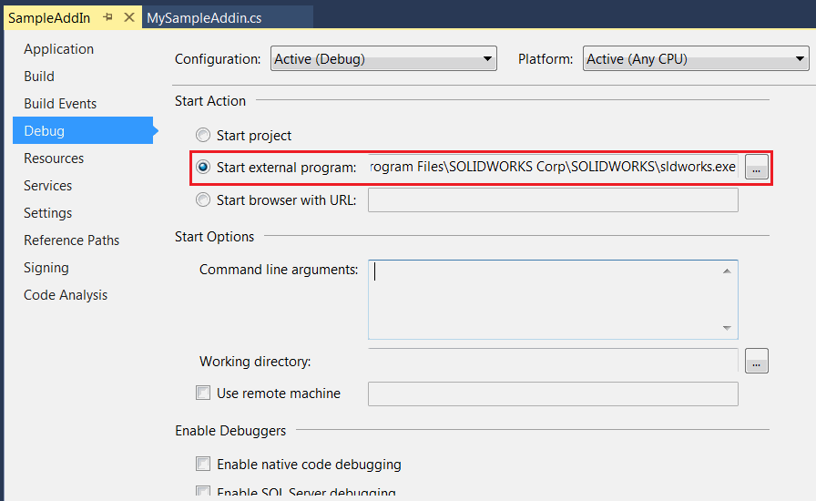
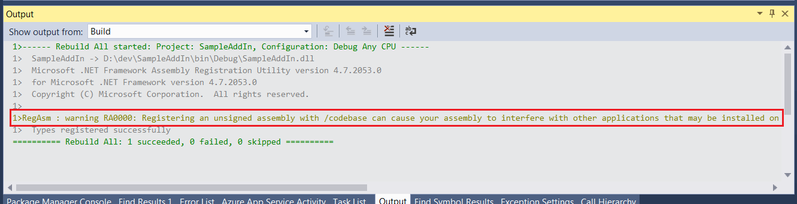

* Create new project in Microsoft Visual Studio
* Select *Class Library* template under the *Visual C#* templates. Specify the location and the name of the project

{ width=450 }

* Add reference to SolidWorks Interop libraries: SolidWorks.Interop.sldworks.dll, SolidWorks.Interop.swconst.dll, SolidWorks.Interop.swpublished.dll. Interop libraries are located at **SOLIDWORKS Installation Folder**\api\redist for projects targeting Framework 4.0 onwards and **SOLIDWORKS Installation Folder**\api\redist\CLR2 for projects targeting Framework 2.0 and 3.5.

For projects targeting Framework 4.0 I recommend to set the **[Embed Interop Types](https://docs.microsoft.com/en-us/dotnet/framework/interop/type-equivalence-and-embedded-interop-types)** option to false.
Otherwise it is possible to have unpredictable behaviour of the application when calling the SOLIDWORKS API due to a type cast issue.  

{ width=350 }

> In some tutorials reference to solidworkstools.dll library is added. This library is optional and it won't be used in this tutorial

* Add a public class with a user friendly name. This will be a main class of the add-in. This class must be public and COM-visible. I would recommend to use [ComVisibleAttribute](https://docs.microsoft.com/en-us/dotnet/api/system.runtime.interopservices.comvisibleattribute?view=netframework-4.7.2) to mark the class as COM visible object and [GuidAttribute](https://docs.microsoft.com/en-gb/dotnet/api/system.runtime.interopservices.guidattribute?view=netframework-4.7.2) to explicitly assign COM GUID for the add-in class:

~~~ cs
[ComVisible(true)]
[Guid("31B803E0-7A01-4841-A0DE-895B726625C9")]
public class MySampleAddin : ISwAddin
{
    ...
}
~~~

I would recommend to not select *Make assembly COM-Visible* option in the project settings but only mark required classes as COM visible as described above.

{ width=400 }

* Add-in dll must be registered with /codebase flag. *Register for COM interop* options available in the project setting doesn't use this option while registering and not suitable in this case. Instead add the post build action as follows:

~~~ bat
"%windir%\Microsoft.NET\Framework64\v4.0.30319\regasm" /codebase "$(TargetPath)"
~~~

{ width=400 }

This would ensure the proper registration on each build of the add-in project.

* For the enhanced debugging experience I would recommend to setup the full path to SOLIDWORKS as an external application in project settings.

{ width=400 }

This would allow to start SOLIDWORKS and automatically attach the debugger from the Visual Studio by pressing green run button or F5 key.

* Registry information needs to be added to SOLIDWORKS registry branch to make it visible for the application. To simplify the process this information can be automatically added and removed when dll is registered and unregistered as COM object by defining the functions and decorating them with [ComRegisterFunctionAttribute](https://docs.microsoft.com/en-us/dotnet/api/system.runtime.interopservices.comregisterfunctionattribute?view=netframework-4.7.2) and [ComUnregisterFunctionAttribute](https://docs.microsoft.com/en-us/dotnet/api/system.runtime.interopservices.comunregisterfunctionattribute?view=netframework-4.7.2) attributes.

* Copy paste the code for the add-in as shown below and compile the project



* When compiled the following warning can be displayed.

{ width=450 }

This warning can be ignored.

* Run SOLIDWORKS and the *Hello World* message box is displayed on start.

The above code can be simplified as shown below with a help of [xCAD.NET Framework](https://xcad.net/) framework:

~~~ cs
[Title("Sample Add-In")]
[Description("Sample 'Hello World' SOLIDWORKS add-in")]
[ComVisible(true), Guid("31B803E0-7A01-4841-A0DE-895B726625C9")]
public class MySampleAddIn : SwAddInEx
{
    public override void OnConnect()
    {
        Application.ShowMessageBox("Hello World!");
    }
}
~~~