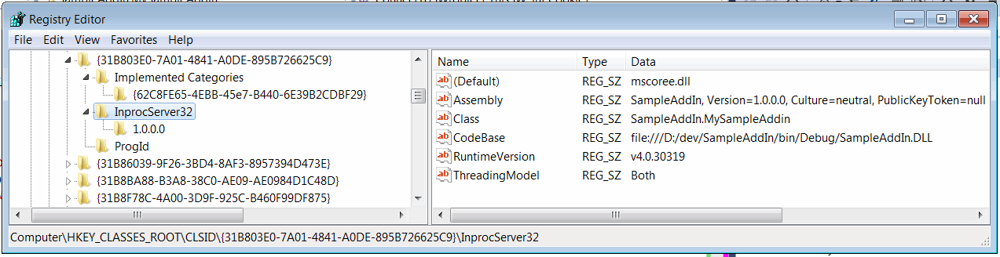
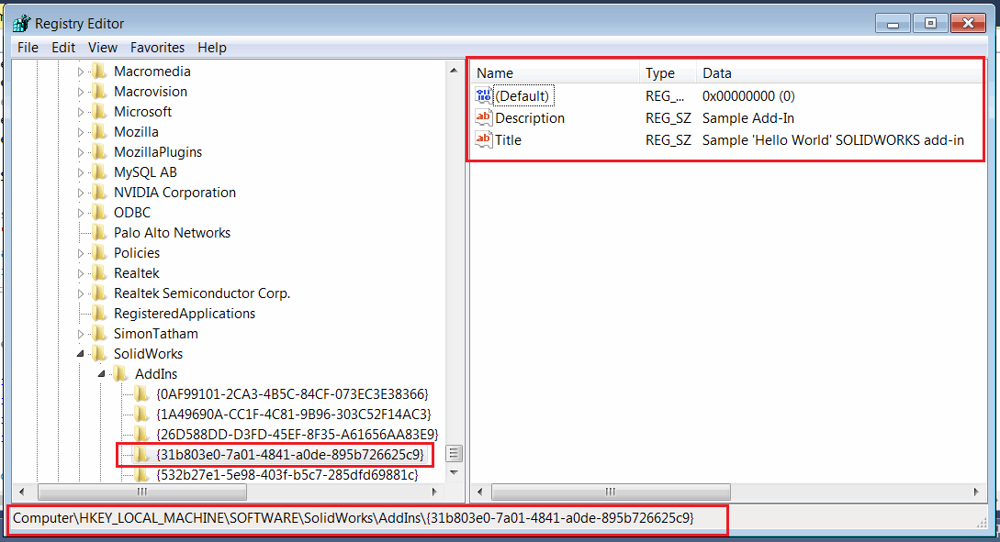
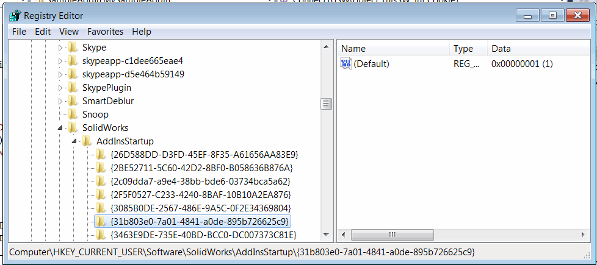
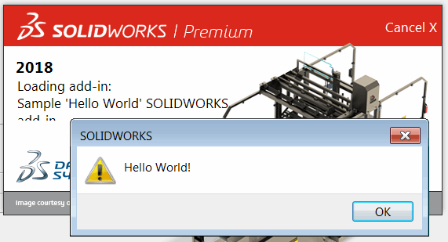
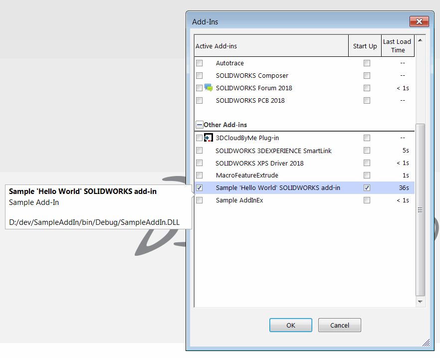

SOLIDWORKS add-ins are in-process applications for SOLIDWORKS which enable high level of customization and best performance and user experience using SOLIDWORKS API. Add-ins can be loaded on start and integrated into the application by providing the ability to extend SOLIDWORKS user interface and functionality.

SOLIDWORKS add-in is a COM object which can be developed using any COM-compatible languages, such as C++, C#, VB.NET, VB6.

In order to develop the add-in it is required to:

* Create public COM-visible class which implements [ISwAddIn](https://help.solidworks.com/2015/english/api/swpublishedapi/solidworks.interop.swpublished~solidworks.interop.swpublished.iswaddin.html) interface

* Register the dll as a COM server using [Regasm](https://docs.microsoft.com/en-us/dotnet/framework/tools/regasm-exe-assembly-registration-tool) for .NET based add-ins (C# or VB.NET) and [RegSvr32](https://en.wikipedia.org/wiki/Regsvr32) for C++ and VB6 based add-ins. It is required to add a *codebase* of the dll while registering the COM object.

{ width=550 }

* Add the information about the add-in to SOLIDWORKS registry so it can be recognized on loading. Add-in information needs to be added to *SOFTWARE\SolidWorks\Addins\\{AddInGuid}* and *Software\SolidWorks\AddInsStartup\\{AddInGuid}*. First key defines the name and description of the add-in and is mandatory. Second key is optional and allows to specify if add-in needs to be loaded on start-up when SOLIDWORKS started.

{ width=450 }

{ width=450 }

## Implementing add-in

[ISwAddIn](https://help.solidworks.com/2015/english/api/swpublishedapi/solidworks.interop.swpublished~solidworks.interop.swpublished.iswaddin.html) interface provides two functions to implement:

* [ConnectToSW](https://help.solidworks.com/2015/english/api/swpublishedapi/SolidWorks.Interop.swpublished~SolidWorks.Interop.swpublished.ISwAddin~ConnectToSW.html). Called when add-in is loaded with SOLIDWORKS (if load at startup option is specified) or when enabled from Tools->AddIns menu in SOLIDWORKS. Function passes 2 parameters: pointer to main [ISldWorks](https://help.solidworks.com/2015/english/api/sldworksapi/solidworks.interop.sldworks~solidworks.interop.sldworks.isldworks_members.html) interface and add-in id.

> Store the pointer to ISldWorks and use it throughout the code to access all interfaces. Do not use [CreateObject](https://docs.microsoft.com/en-us/dotnet/api/microsoft.visualbasic.interaction.createobject?view=netframework-4.7.2) or [Activator::CreateInstance](https://docs.microsoft.com/en-us/dotnet/api/system.activator.createinstance?view=netframework-4.7.2) methods to retrieve the pointer to the application as this approach doesn't guarantee the connection to current instance of SOLIDWORKS and new background session can be started instead.

Second parameter is an id of the add-in which can be used to add UI components in the methods such as 
[ISldWorks::GetCommandManager](https://help.solidworks.com/2015/english/api/sldworksapi/solidworks.interop.sldworks~solidworks.interop.sldworks.isldworks~getcommandmanager.html), [ISldWorks::AddFileSaveAsItem2](https://help.solidworks.com/2015/english/api/sldworksapi/solidworks.interop.sldworks~solidworks.interop.sldworks.isldworks~addfilesaveasitem2.html), [ISldWorks::ShowBubbleTooltipAt2](https://help.solidworks.com/2015/english/api/sldworksapi/solidworks.interop.sldworks~solidworks.interop.sldworks.isldworks~showbubbletooltipat2.html)

Use this method to initiate resources and create user interface (command manager, task pane, etc.).

* [DisconnectFromSW](https://help.solidworks.com/2015/english/api/swpublishedapi/SolidWorks.Interop.swpublished~SolidWorks.Interop.swpublished.ISwAddin~DisconnectFromSW.html). Called when add-in is unloaded when SOLIDWORKS is closing or when disabled from Tools->AddIns menu in SOLIDWORKS. Use this method to clear the resource and remove all user interface elements (such as command manager or task pane).

> It is imported to unload the User Interface pages as user can unload the add-in by disabling this in the add-in menu (not only by closing the SOLIDWORKS application) and keeping the User Interface pages loaded may introduce the risks of crash or instability as the page become disconnected from the add-in itself.

## Development Environment

The most popular development environment for SOLIDWORKS add-in is [Microsoft Visual Studio](https://visualstudio.microsoft.com/). There are different editions of Visual Studio: Professional, Enterprise and Community. You might be eligible for a free version of [Community Edition](https://visualstudio.microsoft.com/vs/community/). Check EULA for more information. Alternative free environment is [SharpDevelop](https://www.icsharpcode.net/).

## Examples

Links below provide the detailed guides for creating the simple 'Hello World' add-in in different programming languages.

* [C#](csharp)
* [VB.NET](vbnet)

Add-in loads on startup and displays the 'Hello World' message box when loaded

{ width=350 }

Add-in is available from the 'Add-Ins...' dialog in SOLIDWORKS Tools menu.

{ width=450 }

## Development Framework

Development of the SOLIDWORKS add-ins in .NET (C# or VB.NET) can be significantly simplified with free and open source [SwEx Framework](/labs/solidworks/swex/). Framework encapsulates complexity of COM classes and the API object model to fit .NET environment and benefit from the features of the language (such as strong types). 