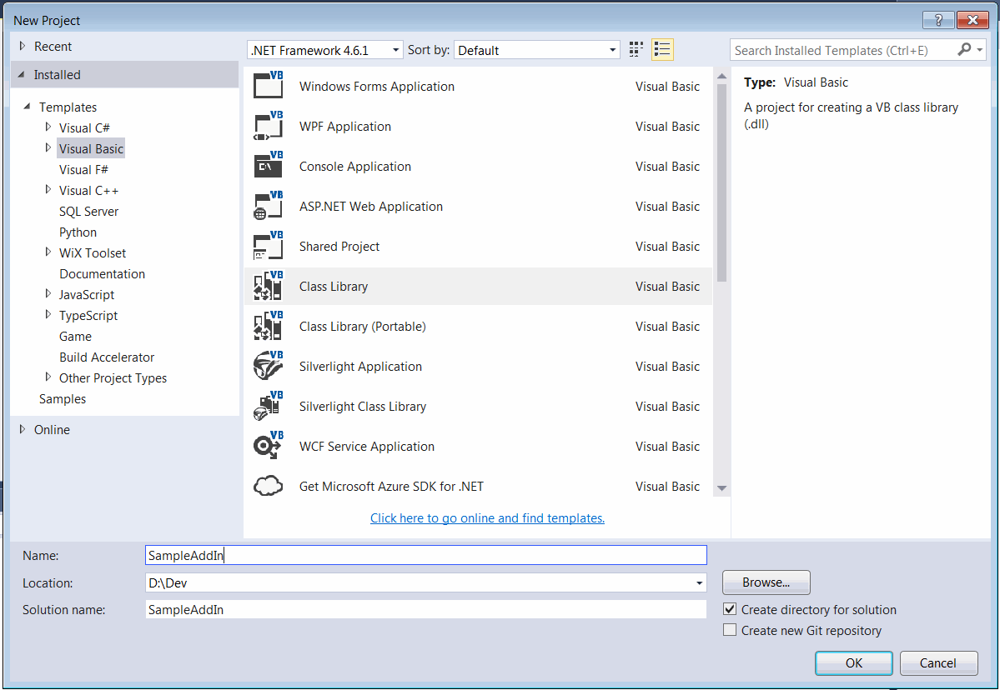
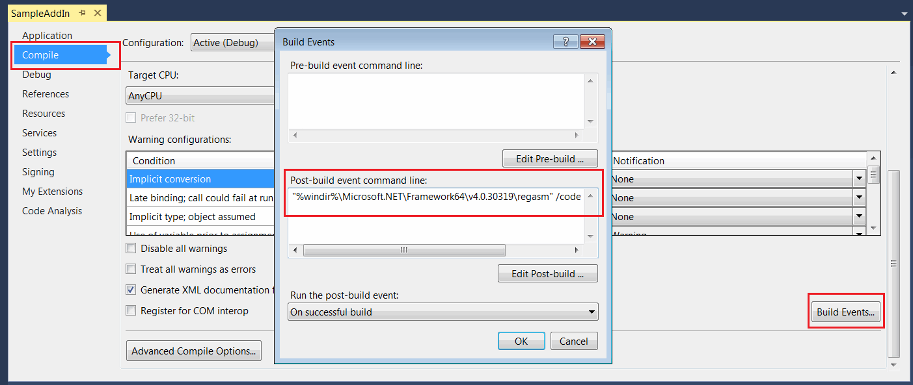
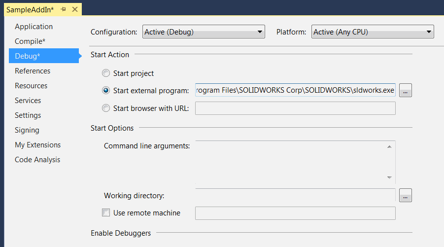
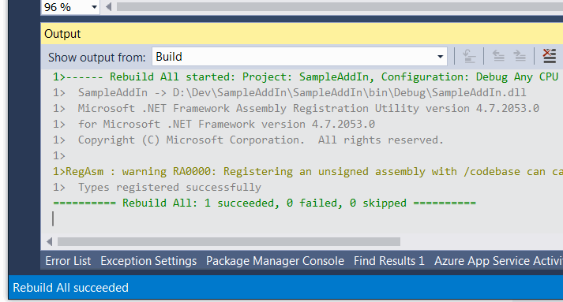

* Create new project in Microsoft Visual Studio
* Select *Class Library* template under the *Visual Basic* templates. Specify the location and the name of the project

{ width=550 }

* Add reference to SolidWorks Interop libraries: SolidWorks.Interop.sldworks.dll, SolidWorks.Interop.swconst.dll, SolidWorks.Interop.swpublished.dll. Interop libraries are located at **SOLIDWORKS Installation Folder**\api\redist for projects targeting Framework 4.0 onwards and **SOLIDWORKS Installation Folder**\api\redist\CLR2 for projects targeting Framework 2.0 and 3.5.

If project targeting Framework 4.0 I would recommend setting the **[Embed Interop Types](https://docs.microsoft.com/en-us/dotnet/framework/interop/type-equivalence-and-embedded-interop-types)** option for all SOLIDWORKS interop dlls to false. In some cases embedded interop libraries causing type casting issues which affects functionality and can result to crash.

{ width=350 }

* Add a public class with a user friendly name which will represent the add-in. This class must be public and COM-visible. I would recommend to decorate the class with [ComVisibleAttribute](https://docs.microsoft.com/en-us/dotnet/api/system.runtime.interopservices.comvisibleattribute?view=netframework-4.7.2) and [GuidAttribute](https://docs.microsoft.com/en-gb/dotnet/api/system.runtime.interopservices.guidattribute?view=netframework-4.7.2) to expose the type to COM and assign the permanent Global Unique Identifier (GUID):

~~~ vb
<ComVisible(True)>
<Guid("799707B3-1632-469F-B294-EC05A5FBFFC8")>
Public Class MySampleAddin
	Implements ISwAddin
    ...
End Class
~~~

Avoid selecting *Make assembly COM-Visible* option in the project settings to expose types to COM and only mark required classes as COM visible with the attributes described above.

* Add-in dll must be registered with /codebase flag. *Register for COM interop* options available in the project setting doesn't use this option while registering and not suitable in this case, furthermore this option would register the type in the 32-bit registry while SOLIDWORKS requires the entries in 64-bit registry. Instead add the post build action as follows:

~~~ bat
"%windir%\Microsoft.NET\Framework64\v4.0.30319\regasm" /codebase "$(TargetPath)"
~~~

This would ensure the proper registration after each compilation of the add-in project.

* For the enhanced debugging experience I would recommend to specify the full path to SOLIDWORKS as an external application in project settings.

This would automatically start SOLIDWORKS by pressing green run button or F5 key and attach the debugger from the Visual Studio.

* Registry information needs to be added to SOLIDWORKS registry branch to make it visible for the application. To simplify the process this information can be automatically added and removed when dll is registered and unregistered as COM object by defining the functions and decorating them with [ComRegisterFunctionAttribute](https://docs.microsoft.com/en-us/dotnet/api/system.runtime.interopservices.comregisterfunctionattribute?view=netframework-4.7.2) and [ComUnregisterFunctionAttribute](https://docs.microsoft.com/en-us/dotnet/api/system.runtime.interopservices.comunregisterfunctionattribute?view=netframework-4.7.2) attributes.

* Copy paste the code for the add-in as shown below and compile the project



* You can ignore the following warning displayed in the Visual Studio window while compilation.

{ width=450 }

* Run SOLIDWORKS and the *Hello World* message box is displayed on start.

The above code can be simplified as shown below with a help of [SwEx.AddIn](/labs/solidworks/swex/add-in/) framework:

~~~ vb
<AutoRegister("Sample Add-In", "Sample 'Hello World' SOLIDWORKS add-in", True)>
<ComVisible(True), Guid("799707B3-1632-469F-B294-EC05A5FBFFC8")>
Public Class MySampleAddIn
    Inherits SwAddInEx

    Public Overrides Function OnConnect() As Boolean
        Return True
    End Function

End Class
~~~