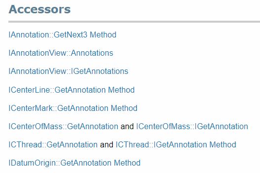

Accessibility of certain interface can be found in the *Accessors* section of specific interface in the SOLIDWORKS API Help documentation.

For example, the snapshot below is an *Accessors* section of the [IAnnotation Interface](https://help.solidworks.com/2018/english/api/sldworksapi/SolidWorks.Interop.sldworks~SolidWorks.Interop.sldworks.IAnnotation.html)

{ width=250 }

Which means that the pointer to [IAnnotation Interface](https://help.solidworks.com/2018/english/api/sldworksapi/SolidWorks.Interop.sldworks~SolidWorks.Interop.sldworks.IAnnotation.html) could be retrieved either via [IAnnotation::GetNext2 Method](https://help.solidworks.com/2018/english/api/sldworksapi/SOLIDWORKS.Interop.sldworks~SOLIDWORKS.Interop.sldworks.IAnnotation~GetNext3.html) or [IAnnotationView::Annotations](https://help.solidworks.com/2018/english/api/sldworksapi/SolidWorks.Interop.sldworks~SolidWorks.Interop.sldworks.IAnnotationView~Annotations.html) property or other properties or methods in this list.

Some of the interfaces can be explicitly or implicitly cast from one to another. For example [IModelDoc2](https://help.solidworks.com/2018/english/api/sldworksapi/SolidWorks.Interop.sldworks~SolidWorks.Interop.sldworks.IModelDoc2.html) represents the parent interface (although there is no direct inheritance) for [IPartDoc](https://help.solidworks.com/2018/english/api/sldworksapi/SolidWorks.Interop.sldworks~SolidWorks.Interop.sldworks.IPartDoc.html),
[IAssemblyDoc](https://help.solidworks.com/2018/english/api/sldworksapi/SolidWorks.Interop.sldworks~SolidWorks.Interop.sldworks.IAssemblyDoc.html), [IDrawingDoc](https://help.solidworks.com/2018/english/api/sldworksapi/SolidWorks.Interop.sldworks~SolidWorks.Interop.sldworks.IDrawingDoc.html) interfaces.

Which means that both parent and specific object would be pointing to the same object in memory.

**VBA**
~~~ vb
Dim swModel As SldWorks.ModelDoc2
...
Dim swPart As SldWorks.PartDoc
Set swPart = swModel
~~~

**VB.NET**
~~~ vb
Dim swModel As IModelDoc2
...
Dim swPart As IPartDoc = CType(swModel, IPartDoc)
~~~

**C#**
~~~ cs
IModelDoc2 model;
...
IPartDoc part = model as IPartDoc;
~~~

**C++**
~~~ cpp
LPMODELDOC2 pModelDoc;
...
LPPARTDOC pPartDoc = NULL;
hres = pModelDoc->QueryInterface(IID_IPartDoc, (LPVOID*)&pPartDoc);
~~~
