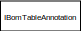
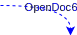
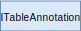
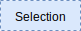
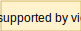
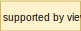

Diagram below displays the relationship between interfaces in the SOLIDWORKS API Object model. This is not a complete class hierarchy rather the representation of the mostly commonly used methods and interfaces.

Diagram is interactive, it is possible to zoom in and zoom out with mouse wheel as well as pan with right or left mouse button. Navigation control in the bottom right corner allows to zoom in and zoom out as well as zoom to fit



All boxes and arrows are clickable and will redirect for the information page about particular method, property or interface.





## Legend

 Represents the entry point of the program. This could be a constructor of the class, connection method, macro entry point

 Represents the interface (object) of the SOLIDWORKS API

 Represents the relation between interfaces via direct casting (Query Interface)

 Represents the relation between interface via method or property

 Represents a group of interfaces

 Represents an interface which is a selectable object in SOLIDWORKS User Interface

 Represents the placeholder for all selectable objects (i.e. the interfaces with blue background)

 Represents the placeholder for other interface which are part of this group

 Represents the placeholder for other interfaces which are part of this group. Interfaces name will match the wildcard
