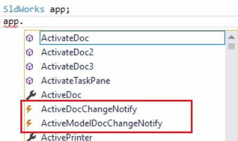
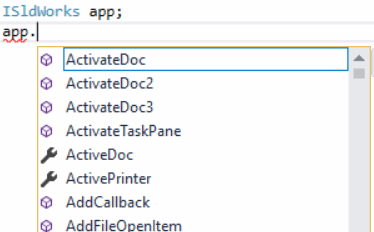

Methods, properties and objects (interfaces) in SOLIDWORKS API help available in 2 versions:

* With **I** at the beginning (e.g. ISldWorks, IModelDoc2, IAnnotation, ISldWorks::IActiveDoc)
* Without **I** at the beginning (e.g. SldWorks, ModelDoc2, Annotation, SldWorks::ActiveDoc)

Both of these alternatives correspond to the same object or method. The main difference are

* I versions of the methods do not expose events

The following snapshot of the available members of the variable declared as *SldWorks*. Events are available

{ width=250 }

The following snapshot of the available members of the variable declared as *ISldWorks*. No events are available

{ width=250 }

* IVersions of the methods usually return type safe version of the interface instead of object or IDispatch. This means that explicit cast is not required for the languages which enforce type safety at compile time (like C#):

~~~ cs
ISldWorks app;
...
IModelDoc2 model = app.IActiveDoc; //correct
IModelDoc2 model = app.ActiveDoc; //Compile error
IModelDoc2 model = app.ActiveDoc as IModelDoc2; //correct
~~~
