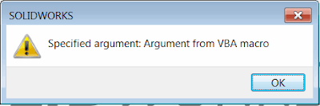

System clipboard allows to store different types of data (that includes but not limited to text, image, html etc.). As the simplest way, the custom argument may be written to the text buffer, but this will clear all the data already in the buffer (if any). This may introduce confusion and result in bad user experience as running the macro may overwrite the text already copied into the clipboard.  

Alternative way is to write the data into the custom buffer with unique name so it is not explicitly exposed to the user and will remain accessible via code only.

Let's start with the 'target' macro which will be called from the different 'master' macro.  



In the example above argument value passed from the 'master' macro will be extracted and displayed to the user in the message box in the 'target' macro:

{ width=400 height=132 }

The helper class reads the buffer value from the **__SwMacroArgs__** format. This is a custom name which is known to both 'master' macro (which will write the value of argument) and the 'target' macro (which will read the value). This can be renamed to any other custom name if needed.



In order to call the macro and pass the argument it is required to set the buffer value for **__SwMacroArgs__** format as the unicode string. Below are examples which demonstrate how to do this in different programming languages

VBA Macro

Argument Helper Module



Macro



C#



VB.NET



**NOTE: the examples above do not handle 'race conditions' (when multiple macros with different arguments may be run in parallel). Use Mutex or Semaphore objects to synchronise the access to shared resources.**
