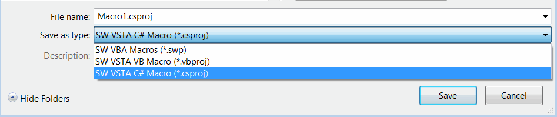
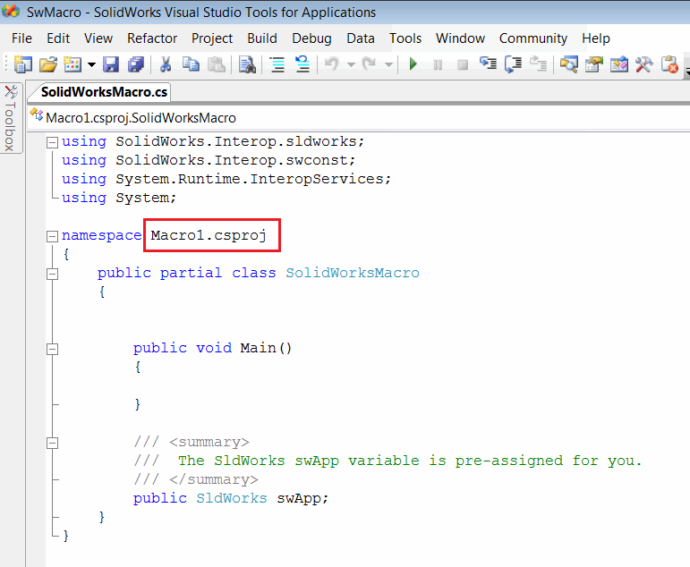
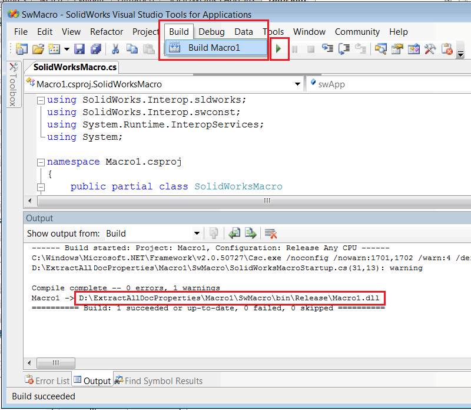
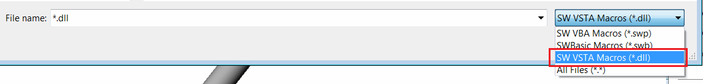
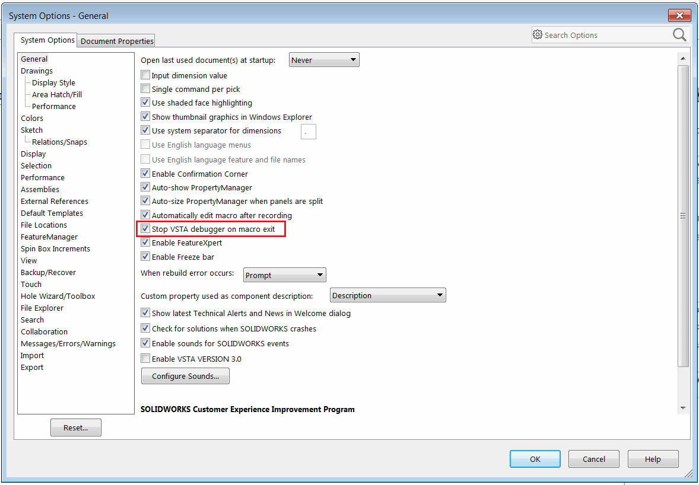

This article explains how to create a VSTA macro (C# or VB.NET) from the existing code and run it

* Create new macro by calling the Tools->Macro->New command from SOLIDWORKS menu
* Set the filter for the VSTA macro (either .vbproj or .csproj depending on the source code)

{ width=450 }

* Copy or remember the namespace of the macro as marked on the picture below in the *SolidWorksMacro.cs* file:

{ width=450 }

* Remove all of the code from the *SolidWorksMacro.cs* file and paste the new source code in there

* Modify the namespace to the original one

> If namespace is not modified the following issue will appear: [Invalid Namespace In VSTA (C# or VB.NET) Macro](solidworks-api/troubleshooting/macros/vsta-invalid-namespace/)

Unlike VBA macros, VSTA macro must be compiled to the dll. Call *Build->Compile* command in the code editor menu. You can also run the macro directly by clicking the green arrow button. Once compiled the dll will be generated in the *bin\Release* folder of the macro and the full path will be printed to the *Output* window as shown below.

{ width=450 }

* To run VSTA macro open *Tools->Macro->Run* command from the SOLIDWORKS menu and select the filter for VSTA macros (dll).

{ width=550 }

> To run the macro only binaries are required. So the content of the *bin\Release* folder can be copied to a new location or shared with another user. It is required to copy the full content of the *bin\Release* folder (not just macro dll) to avoid the following error: [Failed to Run VSTA (C# or VB.NET) Macro](solidworks-api/troubleshooting/macros/run-vsta-macro-error/)

### Keeping VSTA macro running

Option can be set to run the VSTA macro when the execution completed. This is useful if macro needs to monitor SOLIDWORKS events and doesn't need to be unloaded immediately after execution completes. To enable this behaviour uncheck the *Stop VSTA debugger on macro exit* option in the *Tools->Options->System Options* dialog in SOLIDWORKS menu 

{ width=450 }