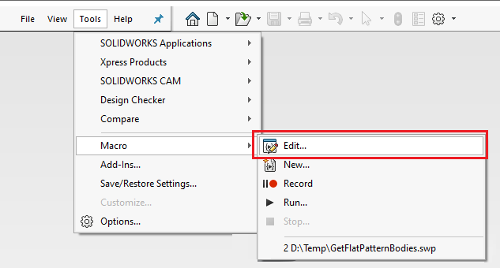

Source code for VBA macros (*.swb and *.swp) as well as VSTA macros (*.csproj and *.vbproj) can be edited directly within SOLIDWORKS.

* Navigate to *Tools->Macro->Edit* menu command

* Browse for the specified macro (change file filter if necessarily)
* Alternatively select the macro from the recent files if available

This command will open new VBA Editor or Visual Studio (VSTA macro editor).

Modify the code as needed and save the changes
