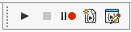
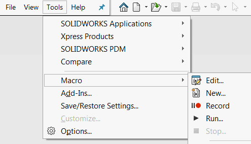



Macros are script-like applications which can be executed and edited directly within SOLIDWORKS environment.

Macros leverage SOLIDWORKS API and 3rd party components API (such as Excel or File System) to compliment the SOLIDWORKS functionality. In most of cases macros are used as an automation scripts to enhance the repetitive task.

There are thousands of macros available for download from various resources such as official [SOLIDWORKS Forum](https://forum.solidworks.com/community/api) or [CodeStack 'Goodies'](/solidworks-tools)

There are 2 main categories of macros supported by SOLIDWORKS: VSTA and VBA macros. Please refer the [Macro Types](/solidworks-api/getting-started/macros/types) article for more details.

Macro toolbar provides commands for

* Running the macro
* [Recording macro](/solidworks-api/getting-started/macros/recording) (as well as stop recording and pausing)
* Creating new blank macro
* Editing the macro
* [Assigning macro to buttons](/solidworks-api/getting-started/macros/macro-buttons)

The above commands are also available from the menu.

{ width=300 }

As macros are usually used in the production environment it is vital to be able to debug and troubleshoot the macro to ensure the quality. Please refer the [Macros Troubleshooting](/solidworks-api/troubleshooting/macros/) for the explanations and resolutions for the most common errors in macros.
