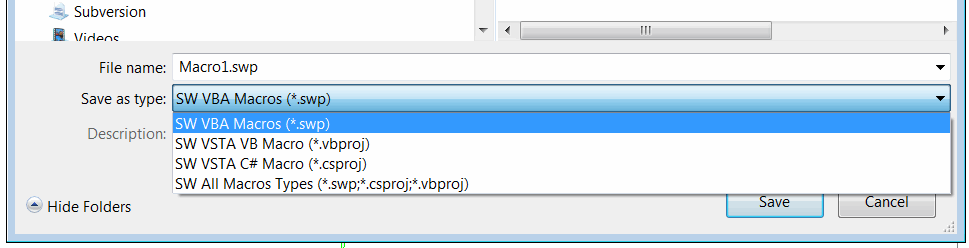
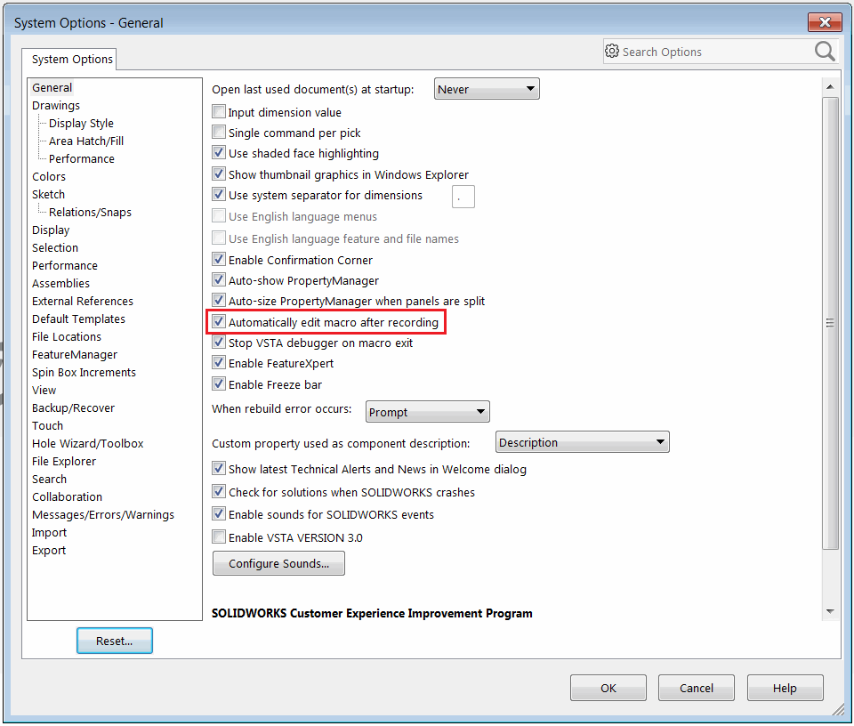
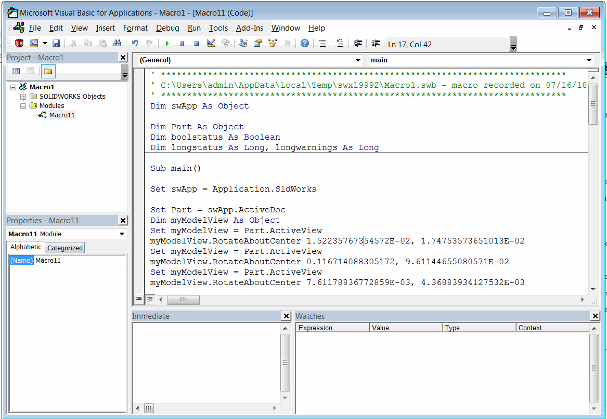
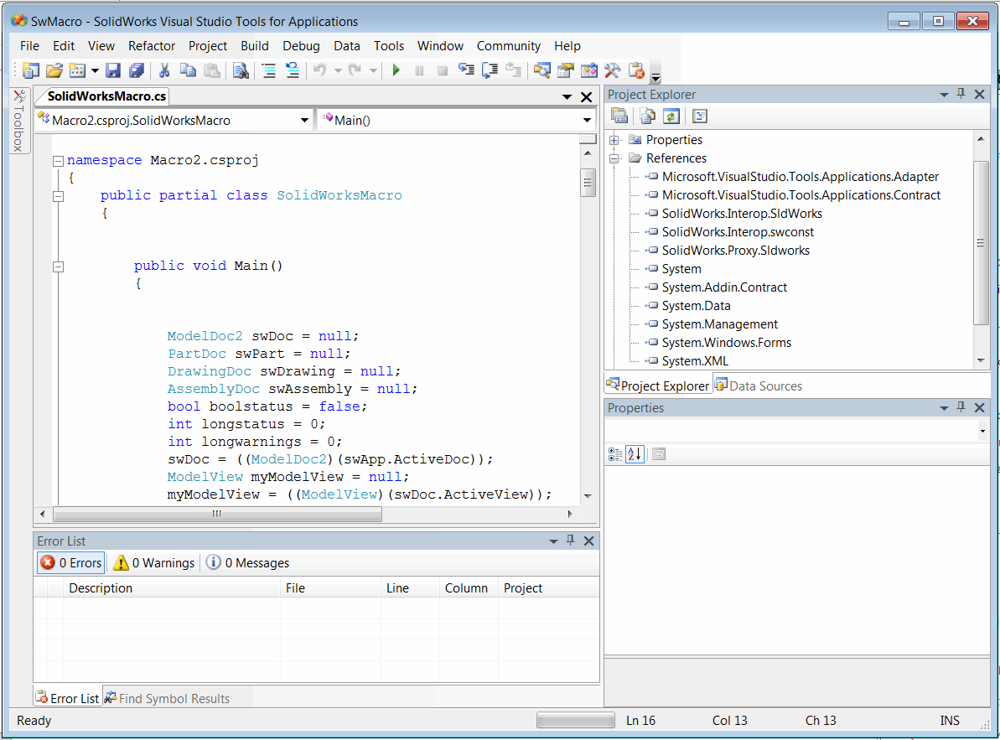
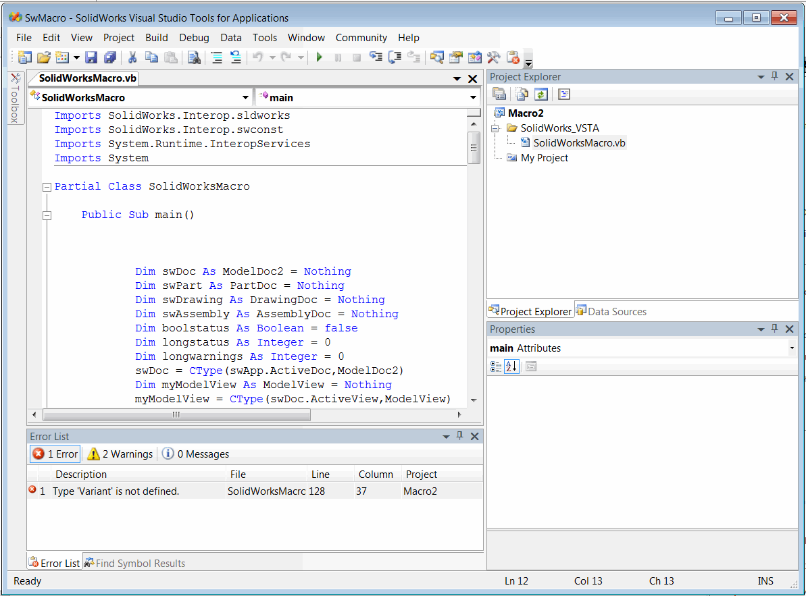

SOLIDWORKS provides the great functionality to record the user actions and transform this into macro code.

This is a very handy feature for learning the SOLIDWORKS API and finding required method.

Recording can be started by clicking the **Record** button on the macro toolbar:

In the recording mode majority of user actions will be recorded

> Note. Not all commands can be recorded via macro recorded. If the command is not captured by the recorded it doesn't mean that API for this particular command is not available

In order to enhance macro recording experience try to minimize the number of model view orientations changes and selections as those commands will be recorded and will make the macro hardly readable due to a large number of lines.

Use **Pause** button to skip recording of unnecessarily manipulations.

Once recording is finished click **Stop** button and select the file to save the recorded macro.

{ width=400 }

Note that it is possible to save the macro as VBA and VSTA. Refer the [Macros Types](/solidworks-api/getting-started/macros/types) article for the explanation of differences between these macro types.

If you record the macros often it is suggested to enable the *Automatically edit macro after recording* option.

{ width=350 }

This would open the editor automatically after macro is finished recording so it is not necessarily to call the *Tools->Macro->Edit* menu command explicitly to edit the source code.

Below are example macros recorded in VBA, C# and VB.NET languages

{ width=350 }

{ width=350 }

{ width=350 }
