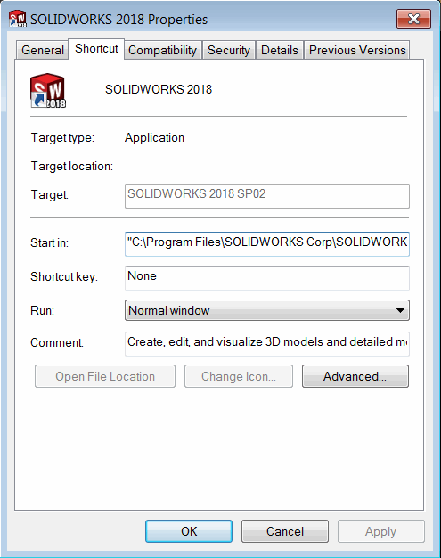
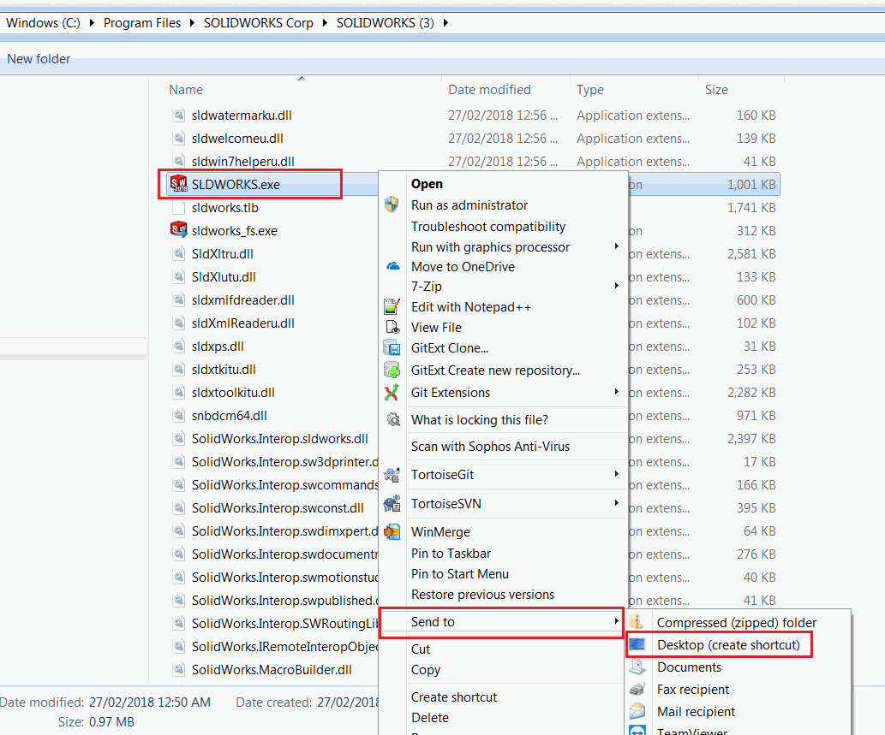
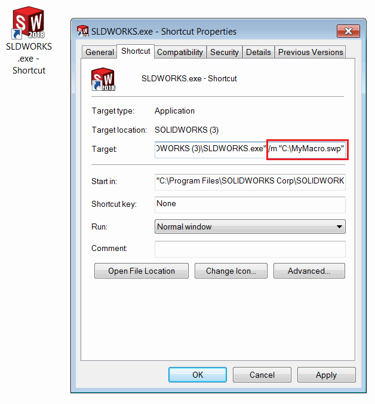

In some cases it might be required to automatically run macro when SOLIDWORKS starts. For example some logging needs ot be done or settings applied.

Fortunately, SOLIDWORKS application accepts command line parameter */m* which will run the specified macro automatically.

~~~ cmd
"Path to SLDWORKS.exe" /m "Path to a macro"
~~~

## Settings up the shortcut to start SOLIDWORKS and run the macro

The most common option to utilize this functionality would be to specify the path to a macro directly in the SOLIDWORKS shortcut on your Windows Desktop. In this case the macro will be run automatically when you are clicking the SOLIDWORKS application shortcut icon (usual routine). Follow the steps below for the instructions:

* Windows OS allows to specify command line arguments in the *Target* field of the shortcut options. The default shortcut has this option disabled and it cannot be changed.

{ width=350 }

* Remove the default SOLIDWORKS shortcut
* Navigate to SOLIDWORKS installation folder (usually *C:\Program Files\SOLIDWORKS Corp\SOLIDWORKS*).
* Find the *SLDWORKS.EXE* file.
* Select the file and click Right Mouse Button. Select *Send To*->*Desktop (create shortcut)*

{ width=550 }

* Shortcut is added to desktop. Rename as required (pin to task bar if needed).
* Select the shortcut icon, click Right Mouse Button and select *Options* command
* Add the following text after the path to SLDWORKS.EXE in the *target* field:

~~~ cmd
/m "Full Path To Macro" 
~~~

If you macro path contains an empty space, enclose the path into double quotes.

For example:

~~~ cmd
"C:\Program Files\SOLIDWORKS Corp\SOLIDWORKS\SLDWORKS.EXE" /m "C:\My Macros\Macro1.swb"
~~~

{ width=450 }

Use this shortcut to start SOLIDWORKS. Specified macro will be run automatically.