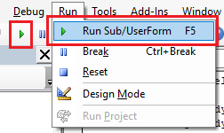

The simplest way to run the macro is to call it from the *Tools->Macro->Run* menu command or toolbar.

Select the macro to run (either .swb or .swp for VBA macro or .dll for VSTA macro). Unless macro explicitly coded to stay active or *Stop VSTA debugger on macro exit* option in *Settings* is checked for VSTA macro, macro is unloaded from the memory once he execution is finished.

Macro can be also run directly from the VBA Editor when [opened for editing](/solidworks-api/getting-started/macros/edit/) either from the menu/toolbar or using *F10* shortcut.

Alternatively, macro can be run from the [macro button](/solidworks-api/getting-started/macros/macro-buttons/) or command line [when SOLIDWORKS session starts](/solidworks-api/getting-started/macros/run-macro-on-solidworks-start/)

