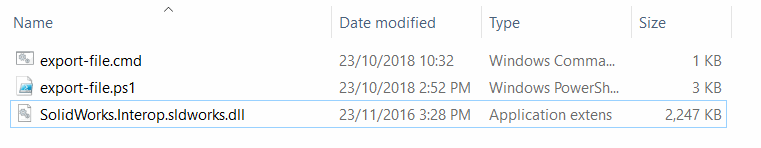
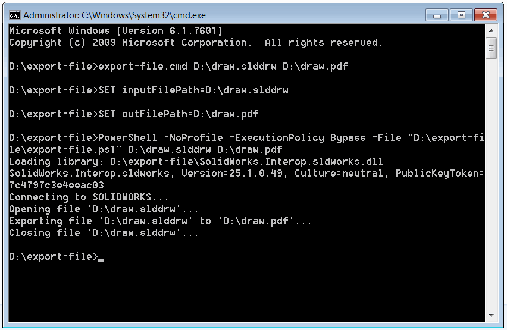

This PowerShell script allows exporting the SOLIDWORKS file into the specified foreign format from the command line using SOLIDWORKS API

## Configuration and usage instructions

* Create two files and paste the code from the below snippets

### export-file.ps1


### export-file.cmd


* Copy the *SolidWorks.Interop.sldworks.dll* into the folder where the above scripts are created. PowerShell script is based on .NET Framework 2.0 so the SOLIDWORKS interop must target this framework. The dll can be found at: **SOLIDWORKS Installation Folder**\api\redist\CLR2\SolidWorks.Interop.sldworks.dll

{ width=450 }

Alternatively full path to SOLIDWORKS interop can be specified as shown below. In this case it is not required to copy this dll into the folder with script files.

~~~ ps1
$Assem = ( 
   "Full path to SolidWorks.Interop.sldworks.dll"
    ) 
~~~

* Start the command line and execute the following command

~~~ bat
[Full Path To export-file.cmd] [Full Path To Input SOLIDWORKS file] [Full Path to output file and extension]
~~~

As the result the file is exported and the process log is displayed directly in the console:

{ width=450 }