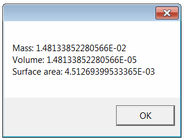

This example demonstrates how to extract mass properties from the specified file using vbScript via SOLIDWORKS API.

* Create a text file and name it as *get-mass-prps.vbs*
* Copy-paste the following code into the file



* Save the file
* Double click to run the script
* Specify the full path to a SOLIDWORKS file (part or assembly) in the displayed input box
* As the result the following message box is displayed with mass property values

{ width=250 }
