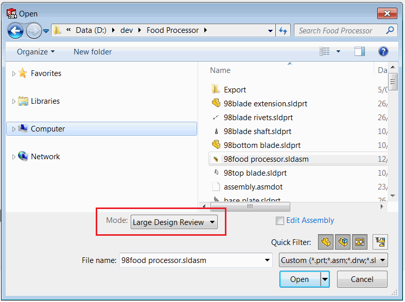
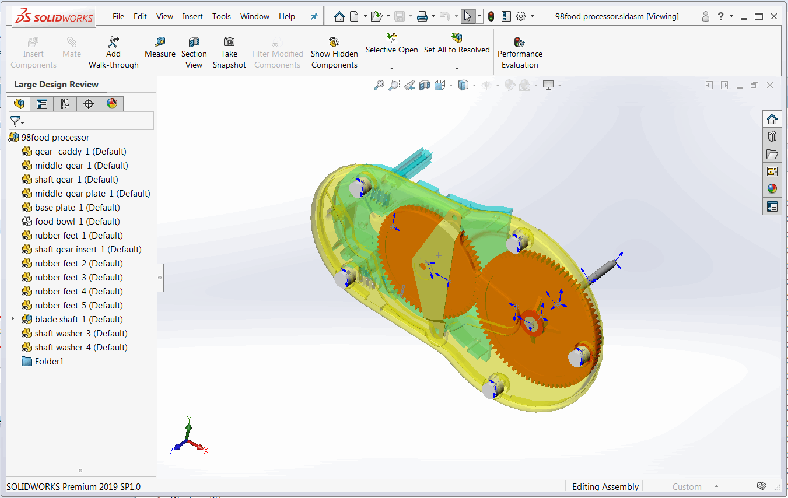
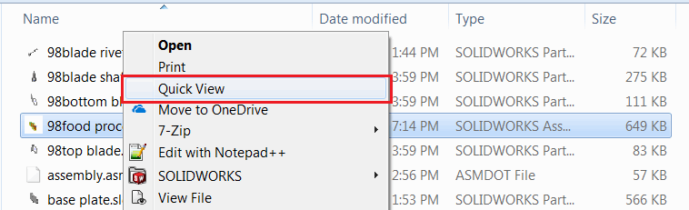

{ width=450 }

SOLIDWORKS enables an option to open large assemblies or drawing in [Large Design Review](https://help.solidworks.com/2018/English/SolidWorks/sldworks/HIDD_DIALOG_LDR_WARNING.htm) mode (aka Quick View). This allows to only load visual information of assembly and drawing and significantly improves the performance (large assembly usually opens in just few seconds instead minutes or even hours). Individual components can be later loaded on demand.

{ width=650 }

However this mode is not supported when opening documents from Windows File Explorer. 

The following guide explains how to enable Quick View mode directly from the Windows File Explorer.

* Create new folder which will contain the script to open the file in Quick View mode
* Create a text file with an extension of .vbs and name it *opener.vbs*
* Paste the following code into this file



* Create another text file and name it *install.cmd*
* Add the following line into the *install.cmd* which will enable a Quick Mode for assemblies

~~~ bat
reg add "HKCR\SldAssem.Document\shell\Quick View\command" /ve /d "wscript.exe """%~dp0opener.vbs""" ""%%1""" /f
~~~

* If you want to enable Quick View model for drawings, add the following line as well

~~~ bat
reg add "HKCR\SldDraw.Document\shell\Quick View\command" /ve /d "wscript.exe """%~dp0opener.vbs""" ""%%1""" /f
~~~

* Save both files. It is important to keep those files in the same folder

{ width=250 }

* Run *install.cmd*. You might need to run this as an administrator

As the result the *Quick View* context menu command is added to the Windows File Explorer. Select any assembly and click right mouse button. Click Quick View and the file will be opened in the quick view mode in SOLIDWORKS:

{ width=450 }
