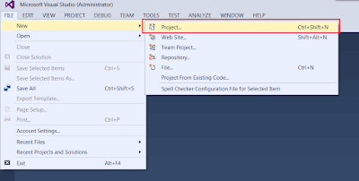
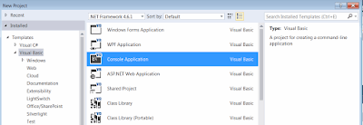
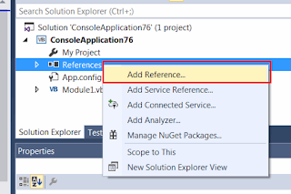
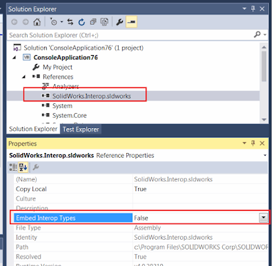

In this tutorial I will demonstrate how to connect to SOLIDWORKS application from out-of-process (a.k.a Stand-Alone) application (e.g. Windows Forms, Windows Console) using VB.NET and Microsoft Visual Studio.

For more detailed explanation of the approaches discussed in this article please read the [Connect To SOLIDWORKS From Stand-Alone Application](/solidworks-api/getting-started/stand-alone/) article.

## Creating new project

I will be using Microsoft Visual Studio development environment. You can use any edition of Visual Studio. The same code will work in Professional, Express or Community editions. Follow this link to download [Visual Studio](https://www.visualstudio.com/vs/community/)  

* Open Visual Studio
* Start new project:

{ width=400 }

* Select the project template. I would recommend to start with Console Application project template as it contains the minimum pregenerated code:

{ width=400 }

* Add reference to SolidWorks Interop library. Interop libraries are located at **SOLIDWORKS Installation Folder**\api\redist\SolidWorks.Interop.sldworks.dll* for projects targeting Framework 4.0 onwards and **SOLIDWORKS Installation Folder**\api\redist\**CLR2**\**SolidWorks.Interop.sldworks.dll* for projects targeting Framework 2.0 and 3.5.

{ width=320 }

For projects targeting Framework 4.0 I recommend to set the **[Embed Interop Types](https://docs.microsoft.com/en-us/dotnet/framework/interop/type-equivalence-and-embedded-interop-types)** option to false.
Otherwise it is possible to have unpredictable behavior of the application when calling the SOLIDWORKS API due to a type cast issue.  

{ width=400 height=385 }

Now we can add the code to connect to SOLIDWORKS instance.  

## Creating or connecting to instance

Probably the most common and quick way to connect to COM server is using the [CreateObject](https://msdn.microsoft.com/en-us/library/microsoft.visualbasic.interaction.createobject(v=vs.110).aspx) method.
Alternative methods are: [Activator::CreateInstance](https://msdn.microsoft.com/en-us/library/system.activator.createinstance(v=vs.110).aspx) and [GetObject](https://msdn.microsoft.com/en-us/library/microsoft.visualbasic.interaction.getobject(v=vs.110).aspx). Note, that [GetObject](https://msdn.microsoft.com/en-us/library/microsoft.visualbasic.interaction.getobject(v=vs.110).aspx) will create new instance if it cannot connect to the active session.  


  
I would recommend to use [Activator::CreateInstance](https://msdn.microsoft.com/en-us/library/system.activator.createinstance(v=vs.110).aspx) as this allows to connect to the session in 2 steps:  

1. As SOLIDWORKS application is registered as COM server we can create the type from its program identifier via [Type::GetTypeFromProgID](https://msdn.microsoft.com/en-us/library/system.type.gettypefromprogid(v=vs.110).aspx) method
1. Construct the instance of the type from the type definition.  

This approach would allow better troubleshooting options in case of an error: if the first step failed it means that either COM class is not registered or cannot be accessed from the registry; otherwise this might indicate some permissions issues.
Please read the [Connect To SOLIDWORKS From Stand-Alone Application](/solidworks-api/getting-started/stand-alone#method-a---activator-and-progid) article for explanations of limitation of this approach.  

Alternatively you can connect to active (already started) session of SOLIDWORKS using the [Marshal::GetActiveObject](https://msdn.microsoft.com/en-us/library/system.runtime.interopservices.marshal.getactiveobject(v=vs.110).aspx) method. Unlike calling the [GetObject](https://msdn.microsoft.com/en-us/library/microsoft.visualbasic.interaction.getobject(v=vs.110).aspx), this approach will ensure that  there will be no new instances of SOLIDWORKS created and will throw an exception if there is no running SOLIDWORKS session to connect to.



## Getting the running instance via ROT

In order to connect to already running specific session of SOLIDWORKS or to be able to create multiple sessions you can use Running Object Table APIs.
Please read the [Connect To SOLIDWORKS From Stand-Alone Application](/solidworks-api/getting-started/stand-alone#method-b---running-object-table-rot) article for more details about this approach.



In the above example new session of SOLIDWORKS is launched by starting new process from SOLIDWORKS application installation path.
*StartSwApp* function requires the full path to **sldworks.exe** as first parameter and optional timeout in seconds as second parameter.
Timeout will ensure that the application won't be locked in case process failed to start.  

You can also make this call asynchronous and display some progress indication in your application while SOLIDWORKS process is starting:


