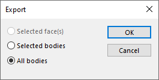

When exporting part file to most of the foreign format supported by SOLIDWORKS it is possible to select the scope bodies of export, allowing to only process selected bodies.

However this feature is not supported by all formats. For example the formats such as 3D xml, xaml, amf, 3mf will always export all bodies, regardless of the selection.

This VBA macro allows to export only selected bodies to any format supported by SOLIDWORKS.

Select the bodies, faces, edges or vertices and run the macro and specify the name of export to produce a result.


