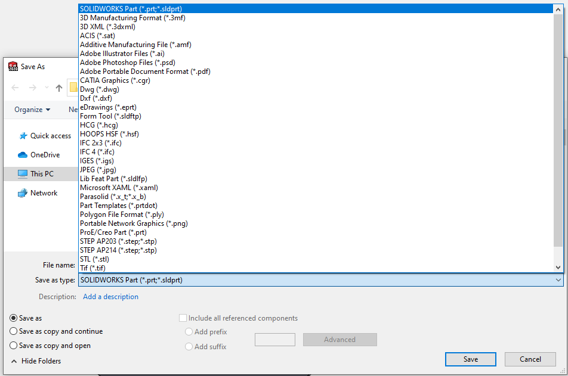

{ width=500 }

This VBA macro allows exporting active SOLIDWORKS document to multiple formats supported by SOLIDWORKS. Macro supports flexible options for specifying file path and allows to export to multiple formats at the same time.

Macro will automatically create directories if not exist.

## Configuration

Macro can be configured by modifying the **OUT_NAME_TEMPLATES**, **OUT_FOLDER** and **ALL_CONFIGS** constants

### Output Name Template

This constant allows to specify template for the output path of the export files. It should contain extension which defines the export format.

This can be either absolute or relative path. If later, result will be saved relative to the file directory or to the directory specified in **OUT_FOLDER** constant if not empty.

> **OUT_FOLDER** can be passed as the [parameter to the macro](https://cadplus.xarial.com/macro-arguments/)

The following placeholders are supported

* <\_FileName\_> - name of the document file (without extension)
* <\_ConfName\_> - name of the active configuration of this file. This changes if **ALL_CONFIGS** option is set to **True**
* <[PropertyName]> - any name of the custom property to read value from, e.g. \<PartNo\> is replaced with the value of custom property *PartNo*. Property will attempt to be read from configuration and if not available, generic property is used.

Placeholders will be resolved for at runtime.

Configure the values in the beginning of the macro, by filling the constant with **Array** function. Specify as many array elements as required.

Following example exports active document to PDF, DXF and JPG and names the output file after the **PartNo** custom property. Files will be saved to the same folder as original file

~~~ vb
Sub main()
        
    OUT_NAME_TEMPLATES = Array("<PartNo>.pdf", "<PartNo>.dxf", "<PartNo>.jpg")
~~~

Following example exports active file to parasolid format into the **D:\Exports** folder. File is named with the name of the original file.

~~~ vb
Sub main()
        
    OUT_NAME_TEMPLATES = Array("D:\Exports\<_FileName_>.x_t")
~~~

### Export Options

Export options for STEP format can be configured by changing the value of the **STEP_VERSION** variable. Set it to **214** for **AP214** format or to **203** to **AP203** format.

~~~ vb
Const STEP_VERSION As Long = 214 '203 or 214
~~~

### Include Component Quantity Into File Name

If this macro is run for all components of the assembly, it might be required to include the BOM quantity into the file name. Use the [Write component quantity in the SOLIDWORKS assembly to custom property
](/solidworks-api/document/assembly/components/write-quantities/) macro. Run this macro for the assembly before exporting to create custom property with the quantity value and then use **\<Qty\>** placeholder in order to include this into the output file name.

### Process All Configuration

If **ALL_CONFIGS** constant is set to **True** macro will activate all configuration (for assembly and part) or all sheets (for drawing) one-by-one and run export command.

## Troubleshooting

If macro reports an error, in some cases it might not be immediately evident what is causing an error as the error details are 'swallowed' by exception handler. In order to disable errors handling and reveal the exact line causing the error comment all *On Error GoTo catch_* lines in the code by placing the apostrophe ' symbol at the beginning of the line as shown below.

~~~ vb jagged
Sub main()
        
    Set swApp = Application.SldWorks
    
try_:
    'On Error GoTo catch_
~~~

Please submit the [bug report](https://github.com/xarial/codestack/issues/new?labels=bug) and attach snapshot of this error and model used to reproduce (if possible)


