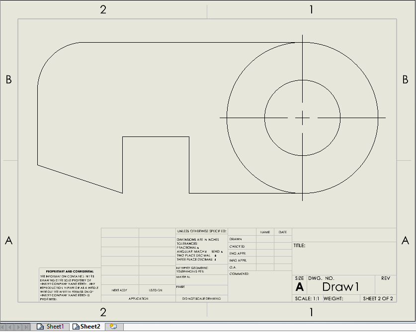

{ width=500 }

This VBA macro allows to export all sheets from the active SOLIDWORKS drawing into the separate PDF files.

PDF files are saved to the same folder as original drawing and named after the sheet. 

*INCLUDE_DRAWING_NAME* option allows to also include the name of the drawing to the output PDF if set to *True*, otherwise only sheet name is used.

~~~ vb jagged-bottom
Const INCLUDE_DRAWING_NAME As Boolean = True 'include the name of the drawing
~~~


