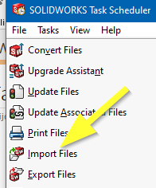
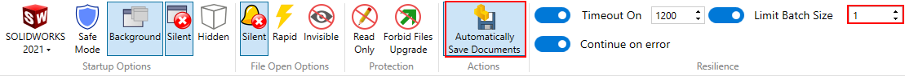

Author: [Eddy Alleman](https://www.linkedin.com/in/eddyalleman/) ([EDAL Solutions](https://www.edalsolutions.be/index.php/en/))

{ width=400 }

## Context situation: 

Suppose we have hundreds of STEP files, all in the same folder from our supplier. 
We want to build a library out of them to reuse again and again in our designs.
To keep the files well separated one from another, we want each STEP file exported in a separate folder per type.

## SOLIDWORKS has a tool for this: Task scheduler

{ width=350 }

But all step files will end up in the same folder, unless we put the STEP files in separate folders first and then the exported Solidworks files to those subfolders.
This is a lot of manual work.

Also we don't know for sure if there are duplicate files and if those files have different level of detail.
We want to be able to choose the best ones after importing and not just overwrite already processed ones.

So how can we automate this and avoid making all those subfolders manually?

## Batch+ with simple macro

Batch+ is a free tool, that is part of CAD+ and it handles a lot of the peculiarities when batch processing files.
We will choose this option because of the easy setup and full control over the process.

The following macro determines if the step is an assembly or a part file.
If it is an assembly then the components will be saved as separate part files (depending on system options, see image above).

The macro creates a subfolder in the same location as and with the same name as the step file.
This helps in separating the files that belong together from other imports.
If you don't put them in a new folder every time, you could get the same file twice
and the last save overwrites the previous ones. Be sure that they are the same in that case.

## PREREQUISITES

(1) make sure you don't have system option set to:
    Prompt user to select document template
    Use instead : "Always use these default document templates"
Otherwise SolidWorks keeps asking to select a document template.

(2) Set system options > import > Enable 3D interconnect OFF
    Documentation about 3D interconnect :
    Insert proprietary CAD data directly into a SOLIDWORKS assembly without converting it to a SOLIDWORKS file.
    And converting is exactly what we want. 3D interconnect just makes a link to the STEP file and updates if needed.

{ width=800 }



