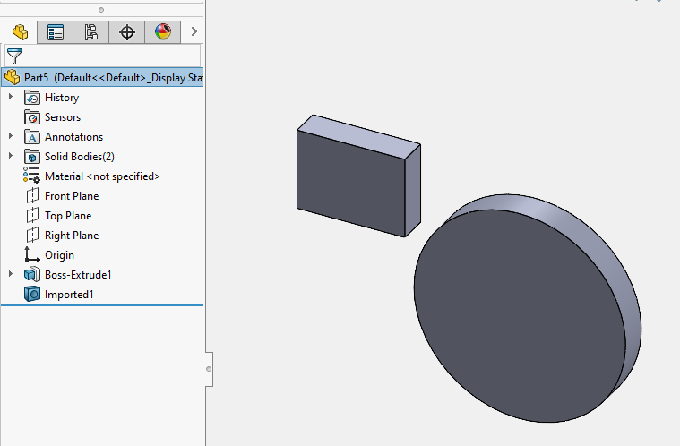

This VBA macro demonstrates how to import foreign file with bodies (e.g. parasolid, step, iges, etc.) directly into the active part document.

Change the path to the import file in the **INPUT_FILE** constant

This macro only supports foreign files which are imported as part document.

