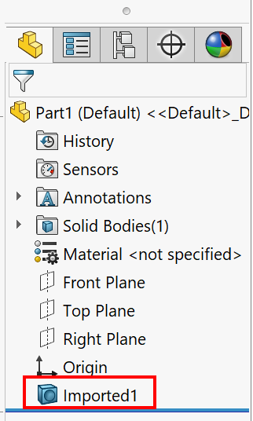

{ width=250 }

This VBA macro scales all bodies form the imported features in active SOLIDWORKS part file. THe imported features will be generated if file is loaded from neutral formats like STEP, IGES, Parasolid unless 3D Interconnect option is used.

Set the scale factor in the **SCALE_FACTOR** constant.

