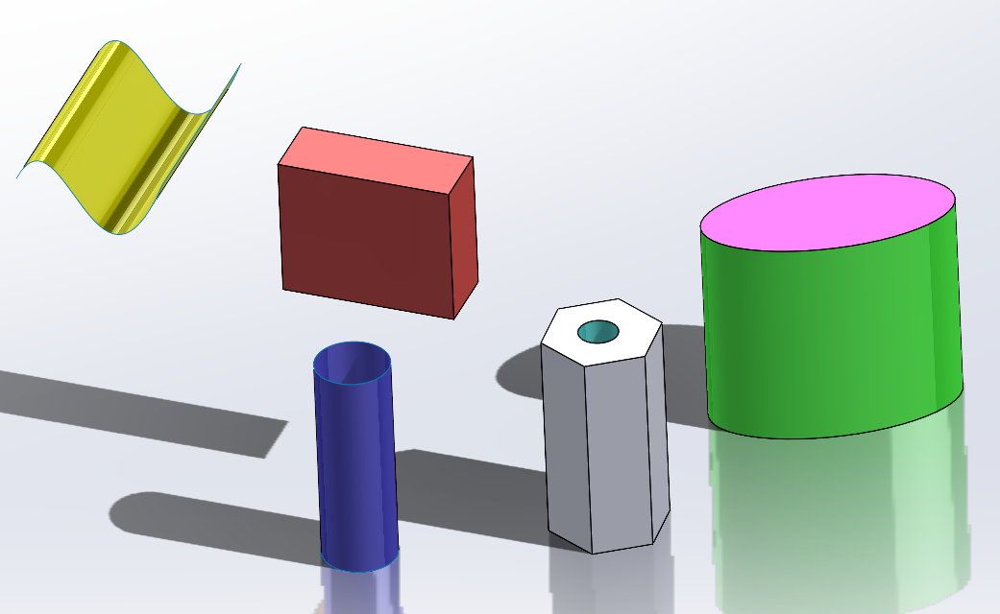

{ width=500 }

This VBA macro allows to split active SOLIDWORKS part file into individual bodies and save each body into the separate part file preserving the bodies appearances.

* Open multi-body part file
* Run the macro
* Select the output folder
* Each body in the defeatured part is saved into individual part file as `{source file name}_{body name}.sldprt`

User can configure the types of bodies to export by changing the value of **BODY_FILTER** and **VISIBLE_BODIES_ONLY** constants

~~~ vb
Const BODY_FILTER As Integer = swBodyType_e.swSheetBody 'only export surface bodies
Const VISIBLE_BODIES_ONLY As Boolean = False 'export both visible and hidden bodies
~~~

> Export is perfromed via roundtrip of the solid body via STEP format. Macro will automatically set and restore required system options to produce the output

