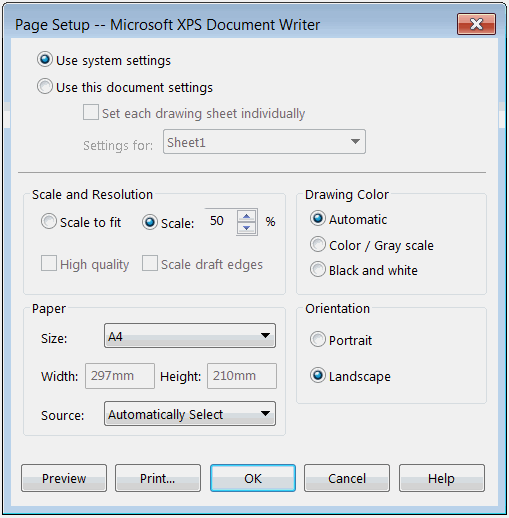

{ width=350 }

This example demonstrates how to change the system page setup option (paper size and scale) and set the current document options to use the system settings using SOLIDWORKS API.

This example also demonstrates how to retrieve the system specific paper size integer for [IPageSetup::PrinterPaperSize](http://help.solidworks.com/2016/english/api/sldworksapi/SolidWorks.Interop.sldworks~SolidWorks.Interop.sldworks.IPageSetup~PrinterPaperSize.html) by specifying the paper name.


