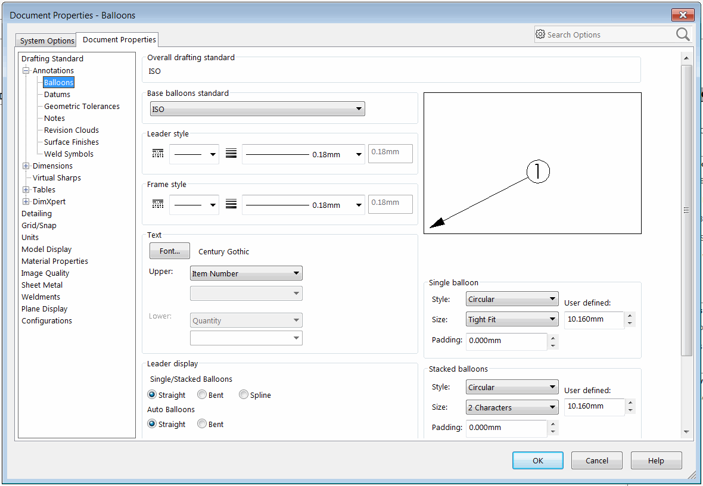
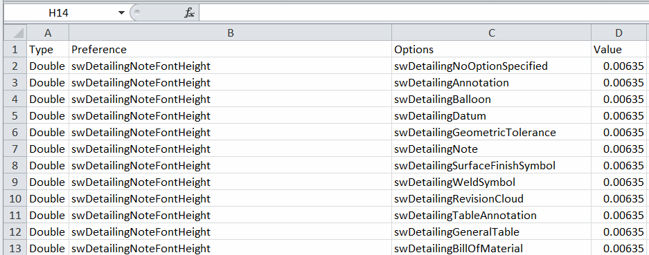
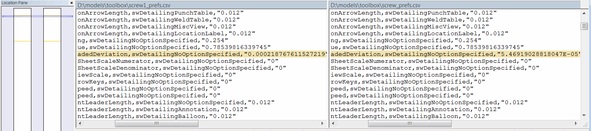

{ width=350 }

This macro exports all document properties (available under the Tools->Options->Document) menu

Macro is utilizing [Reflection](https://docs.microsoft.com/en-us/dotnet/csharp/programming-guide/concepts/reflection) to dynamically read all available user preferences enumerations and calling the corresponding SOLIDWORKS API to extract each property value.

Macro outputs the properties into the CSV file which can be opened in Excel. The following information is included:

* Preference Group - numeric, toggle or text
* ID of preference - the exact option being exported
* Preference option - additional information about preference
* Value - current value of the preference

Refer [System Options and Document Properties](http://help.solidworks.com/2016/english/api/sldworksapiprogguide/overview/system_options_and_document_properties.htm) article for a list of options to match the specific preference ID and value.

{ width=350 }

This macro can be useful if it is required to compare the preferences between different files. Any diff tool can be used to simplify the comparison and identify the differences, such as [WinMerge](http://winmerge.org/)

{ width=550 }

File output location be customized by modifying the *OUT_FILE_PATH* constant at the beginning of the macro.

~~~ cs
const string OUT_FILE_PATH = @""; //Output file will be created at the same location as SOLIDWORKS model and will be named as <ModelName>_prefs.csv
const string OUT_FILE_PATH = @"Options.csv"; //Output file will be created at the same location as SOLIDWORKS model and will be named as Options.csv
const string OUT_FILE_PATH = @"D:\Output\prefs.csv"; //File will be output to D:\Output\prefs.csv
~~~

Refer [Create And Run VSTA Macro](solidworks-api/getting-started/macros/create-vsta/) for information about creating and adding code to VSTA macro.

### C# VSTA Macro


