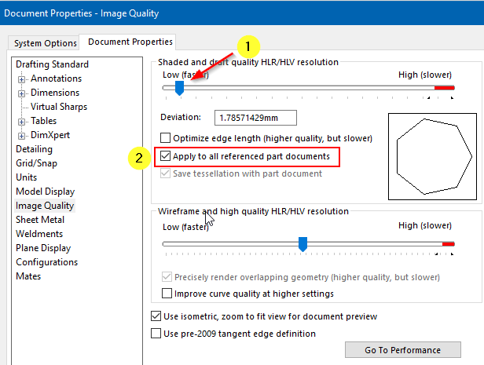
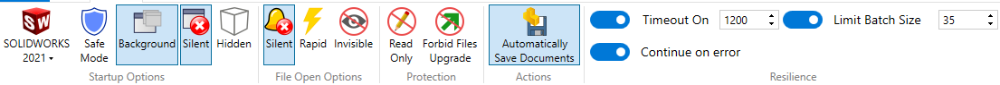

Author: [Eddy Alleman](https://www.linkedin.com/in/eddyalleman/) ([EDAL Solutions](www.edalsolutions.be))

{ width=650 }

When working in large assemblies, there are document options you can set when you want your files to be saved as light as possible:

## Shaded and draft quality HLR/HLV resolution 
Controls the tessellation of curved surfaces for shaded rendering output. A higher resolution setting results in slower model rebuilding but more accurate curves.
Low (faster) - High (slower)  

This means that if you are working in an assembly, you can set all the referenced files to Low ImageQuality manually.

But in case you have a lot of files and need to work in large assemblies a macro can help and make the files lighter before opening the root assembly.

This macro sets both options (1) and (2) as shown in the above image. Option (2) is not available for parts.

The real power begins if you use this macro with Batch+. You can let it run when you're not working on your assembly.

{ width=800 }

