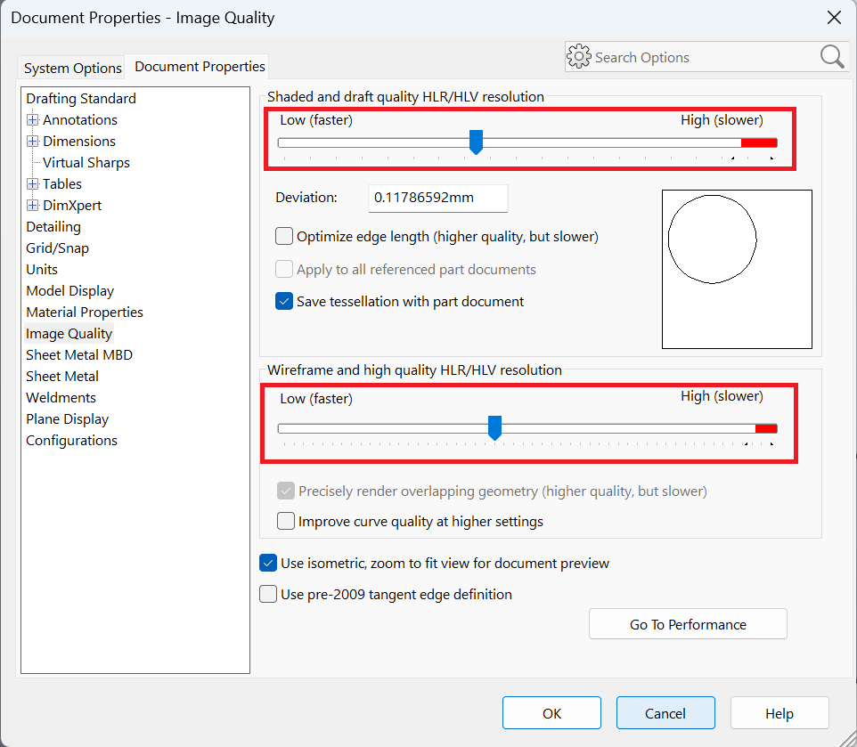

This VBA macro changes the tesselation settings of **Shaded and draft quality HLR/HLV resolution** and **Wireframe and high quality HLT/HLV resolution** settings in the SOLIDWORKS documents

{ width=500 }

This allows to change the quality of tesselation which affects the perfromance and size of the file. Lower quality improves the performance and decreases the file size, file higher quality reduces the performance and increases the file size.

Macro can be configured by specifying the percentage of the position of the slider

~~~ vb
Const SHADED_DRAFT_QUALITY_RESOLUTION As Double = 0.25 '0 for minumum, 1 for maximum, 0.5 for the middle position
Const WIREFRAME_HIGHT_QUALITY_RESOLUTION As Double = 0.25 '0 for minumum, 1 for maximum, 0.5 for the middle position
~~~

