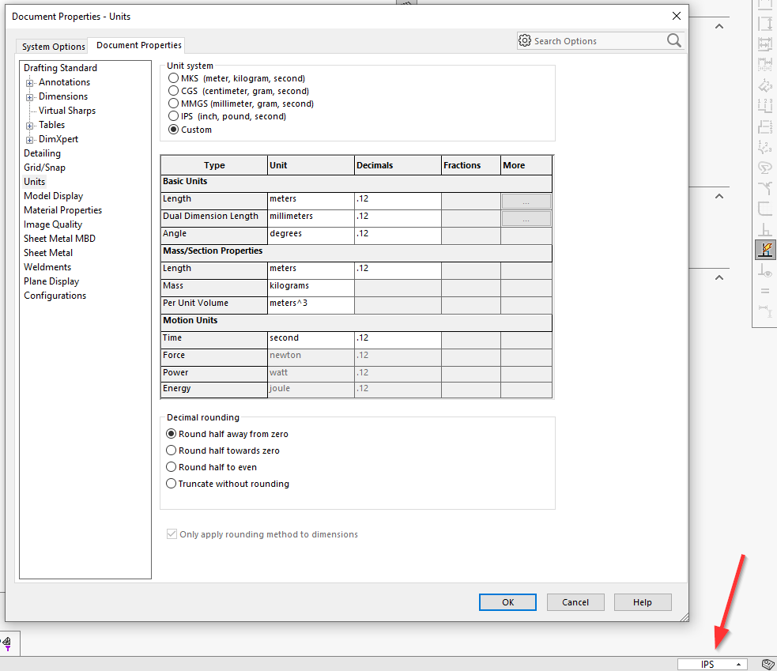

{ width=600 }

This macro allows to change the units of the active SOLIDWORKS document (part or assembly).

Configure the constants of the macro to specify the target unit system

~~~ vb
Const UNIT_SYSTEM As Integer = swUnitSystem_e.swUnitSystem_Custom 'sets the custom units individually as per the constants below

Const CUSTOM_LENGTH_UNIT As Integer = swLengthUnit_e.swMETER
Const CUSTOM_ANGLE_UNIT As Integer = swAngleUnit_e.swDEGREES
Const CUSTOM_MASS_UNIT As Integer = swUnitsMassPropMass_e.swUnitsMassPropMass_Pounds
Const CUSTOM_VOLUME_UNIT As Integer = swUnitsMassPropVolume_e.swUnitsMassPropVolume_Feet3
Const CUSTOM_TIME_UNIT As Integer = swUnitsTimeUnit_e.swUnitsTimeUnit_Second
~~~

If **UNIT_SYSTEM** constant is set to **swUnitSystem_e.swUnitSystem_Custom** then it is required to provide the individual units for each custom type by changing the **CUSTOM_???** constants.

