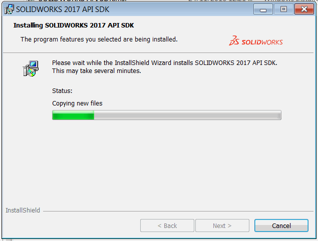
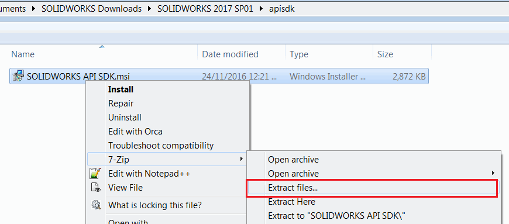
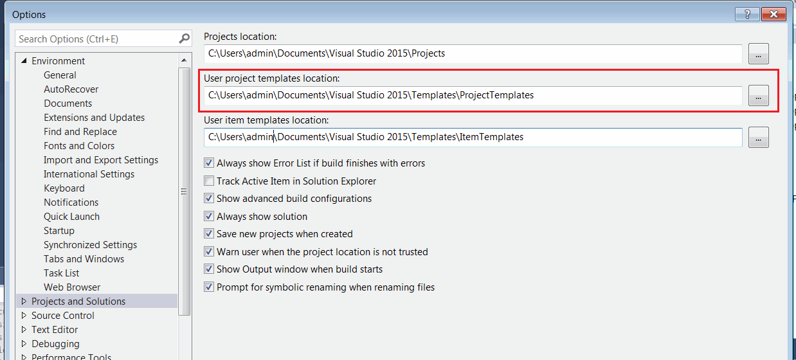
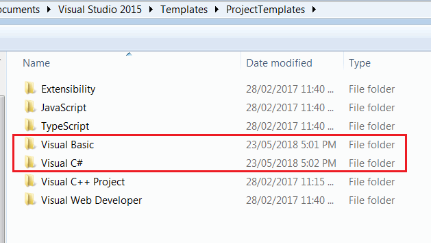
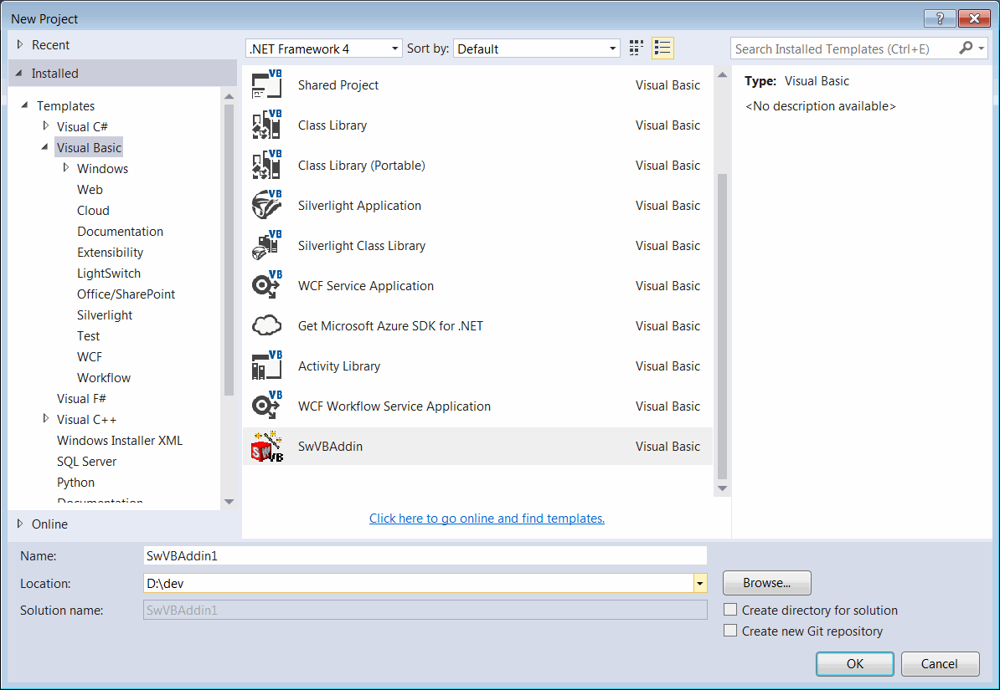
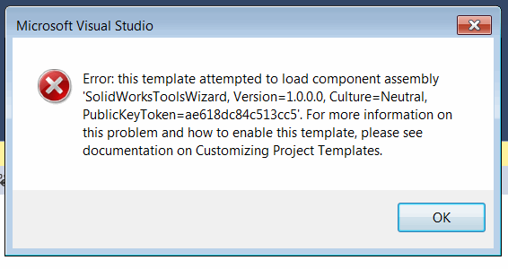
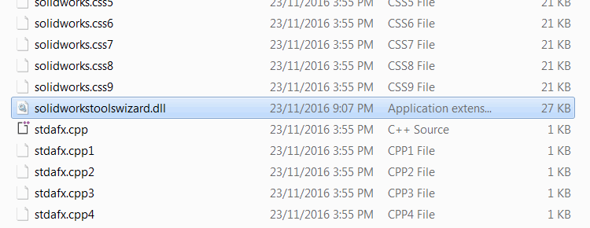
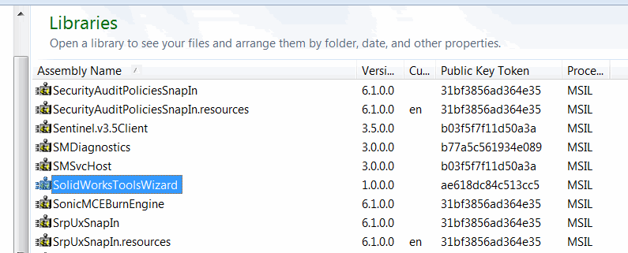

## Symptoms
{ width=250 }

After installation of SOLIDWORKS API SDK no project templates are shown in Visual Studio New Project dialog for C# and VB.NET

## Cause
System error happened while installing the templates and registering the Wizard assembly in the Global Assembly Cache (GAC). This might be caused by permission issues.

## Resolution

* Locate _SOLIDWORKS API SDK.msi_ file. Usually found in _apisdk_ folder of installation DVD or SOLIDWORKS download package.

* The MSI package is a zip storage. Extract (unzip) the file using any Archive tools which support zip format (such as WinRar, WinZip or 7-Zip)

{ width=500 }

* Find _swvbaddin.zip_ for VB.NET template and _swcsharpaddin.zip_ for C# template in the files of the unzipped folder.

* Open Visual Studio and select _Tools->Options..._ menu command. Navigate to _Projects and Solutions_ group.

{ width=400 }

* Copy the path of the _User project templates location_ field value and open this folder in the explorer

* Copy the _swvbaddin.zip_ file into the _Visual Basic_ folder and _swcsharpaddin.zip_ into the _Visual C#_ folder. It is not needed to unzip these files.

* Start Visual Studio and create new project. Now C# and VB.NET project templates are available for selection.

{ width=500 }

If the following error is displayed when creating the project:

* Navigate to the folder unzipped from the _SOLIDWORKS API SDK.msi_ file and find the _SolidWorksToolsWizard.dll_

* This dll needs to be registered in the Global Assembly Cache (GAC). Navigate to _%windir%\assembly_ folder in explorer and drag-n-drop the dll file into the folder

> If **Access Denied** error is displayed while registering the assembly in the GAC, you can use gacutil from Windows SDK and run it from the **Command Prompt** run as administrator **gacutil.exe" /i "{FULL PATH TO solidworkstoolswizard.dll}"**

Alternatively follow the [How to: Install an Assembly into the Global Assembly Cache](https://docs.microsoft.com/en-us/dotnet/framework/app-domains/how-to-install-an-assembly-into-the-gac) article on the guide of registering assembly in GAC.
