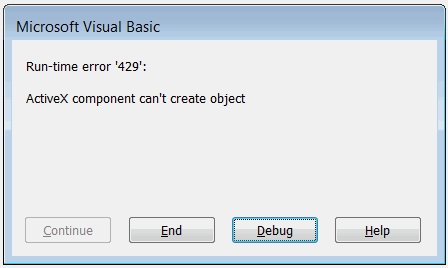

## Symptoms

*Run-time error '429': ActiveX component can't create object* error is displayed when running the macro. Usually the *CreateObject* function is highlighted:

~~~ vb
Dim obj as Object
Set obj = CreateObject("ComComponentProgId")
~~~

{ width=350 }

## Cause

Required COM Component (ActiveX) is not registered on the target machine. This is usually either when target application is not installed (for example Excel, MS Access etc.) or the component is registered in the x32 system while macro is running in x64 environment (since SOLIDWORKS 2012).

## Resolution

Install the required COM components into the correct environment. It might be required to contact the vendor of the component or the developer of the macro for more information about the used ActiveX Component.
