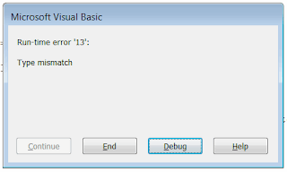
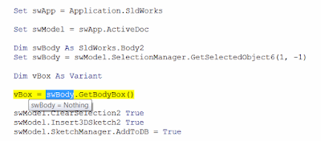

## Symptoms

Running the SOLIDWORKS macro which processes the active model or selection produces *Run-time Error '91': Object variable or With block variable not set* error
or *Run-time error '13': Type mismatch* error or misbehaves in any other way.  

{ width=320 height=191 }

## Cause

Depending on the functionality of the macro it may require certain preconditions to be met, such as part or assembly opened or specific objects (e.g. body, feature, dimension etc.) selected.

If the errors are not handling properly in the macro and user friendly message is not displayed VBA environment will fail.

## Resolution

* Investigate the preconditions of the macro. If possible contact the developer of the macro or compare the differences between conditions where it works and not
* Investigate the code. Check what code line is highlighted when error happens.
For example if *swModel *or *Part *variable is *Nothing *then it is required for the model to be open.
If object assigned from *GetSelectedObjectX *method is *Nothing *then incorrect or no selection was made prior of running the macro

{ width=400 height=175 }
