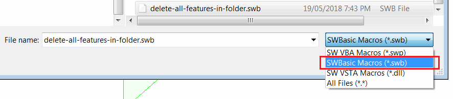
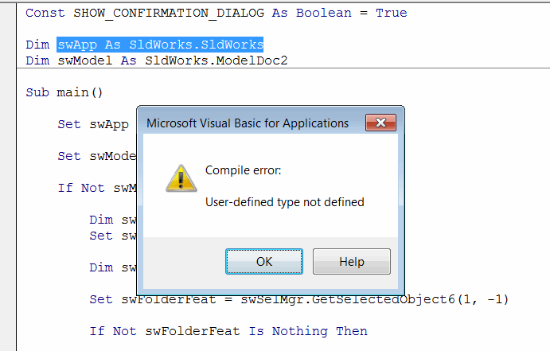
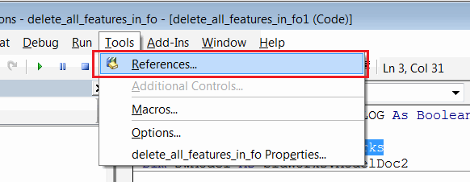
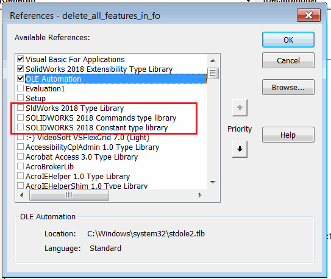

## Symptoms

Legacy SOLIDWORKS macro in *.swb format failed when edited with a 'Compile Error: User-defined type not defined' error. It usually runs correctly if run from the Tools->Macro->Run menu:

{ width=300 }

## Cause

SWBasic macros are scripts stored in ASCII format (i.e. plain text) which cannot store any references information. SOLIDWORKS types are defined in the SOLIDWORKS type libraries which ae not referenced by default in SWBasic macros.

## Resolution

* Open the macro for editing (Tools->Macro->Edit)
* Navigate to the *Tools->References* menu

{ width=300 }

* Check all SOLIDWORKS type libraries

{ width=300 }

* Save the macro in *.swp format
