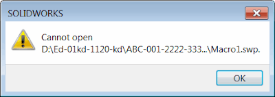

## Symptoms

SOLIDWORKS macro is stored in the PDM vault under the long projects structure or the macro is generated on a fly to the secure location (isolated storage) and run via the SOLIDWORKS API.

When macro runs or edits the *Cannot Open* error is displayed. The macro runs normally from another location.  

{ width=400 height=141 }

## Cause

The maximum supported length of the macro path is 255 symbols.

Although it is highly unlikely the macro to be placed into the directory with full path over 255 symbols, it is still possible that that long path is used when the macro is run from the API and its location needs to be obfuscated (e.g. using the isolated storage).

It is also possible to have long paths in the PDM environments (such as SOLIDWORKS PDM vault) where the folder structure may reflect project numbers, branches, etc.  

## Resolution

There is no way to force SOLIDWORKS to run macro with long path. Move the macro to a new location.
Alternatively it is possible to develop a macro launcher macro which will make a copy of the macro from long path to short path and run.
