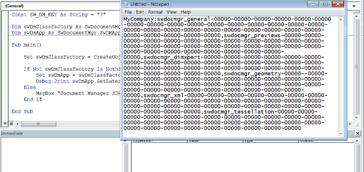

## Symptoms

* SOLIDWORKS VBA macro is utilizing Document Manager APIs and new license was generated.
When generated license is placed into the macro some text highlighted red and *Compile error: Invalid outside procedure error* is displayed
* Macro is inserting static text into the note or custom properties. Text is replaced with new long text. Inserted string is highlighted and macro doesn't run

## Cause

Maximum number of symbols in a single line of VBA code is 1023.
It is not possible to insert more symbols without explicitly splitting the lines.
Pasting the line longer than the limit from the buffer will cause compilation errors.  

## Resolution

Split the line into multiple lines (no longer than 1023 symbols in single line) and use "string1" & _ "string2" to concatenate the lines.  


