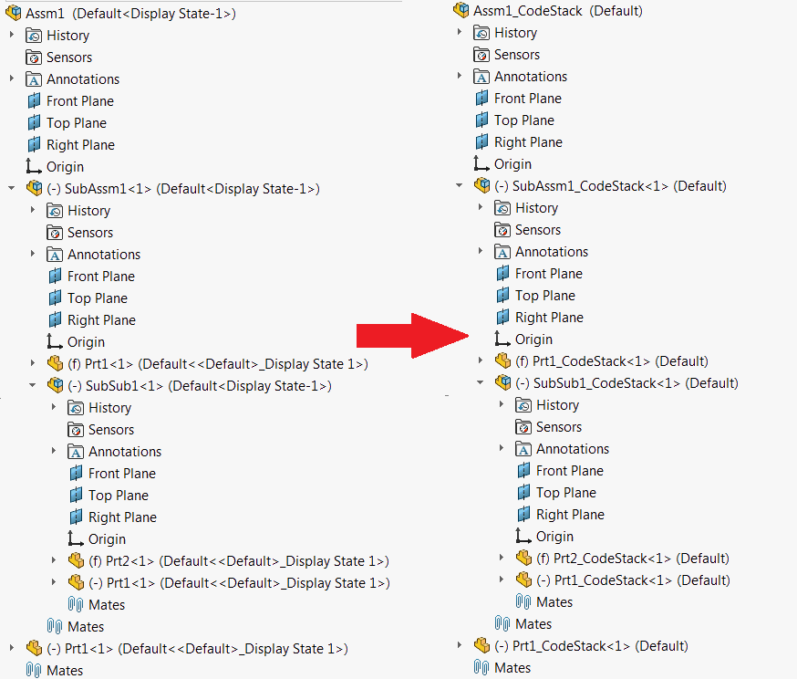

{ width=350 }

This example demonstrates how to copy the assembly or drawing tree to a new location using SOLIDWORKS Document Manager API. Macro allows to add suffix to each file in the tree. Macro will preserve and replace all the required references on all levels of the assembly.

Specify the input file to move, destination folder and suffix in the constants at the beginning of the macro

~~~ vb
Const FILE_PATH As String = "D:\Input\Assm1.SLDASM" 'full path to an input assembly or drawing
Const DEST_FOLDER As String = "D:\Output" 'Destination location. Do not add the backslash '\' at the end of the folder path
Const SUFFIX As String = "_CodeStack" 'Suffix to add to each file in the tree
~~~

[ISwDMApplication::CopyDocument](http://help.solidworks.com/2018/english/api/swdocmgrapi/solidworks.interop.swdocumentmgr~solidworks.interop.swdocumentmgr.iswdmapplication~copydocument.html) Document Manager API is used to perform copying of files and all references.


