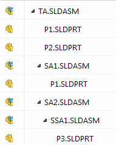

{ width=200 }

This example demonstrates how to get all components on all levels from the document using the Document Manager API.

* Open the macro in SOLIDWORKS
* Specify the document manager key
* Specify the path to top assembly
* Run the macro. All components data is output to Immediate window of VBA editor

To get top level components only modify the function as follows

~~~ vb
Call GetAllComponents(swDmDoc, "", True, comps)
~~~

> Do not store the pointer to [ISwDMComponent](https://help.solidworks.com/2015/english/api/swdocmgrapi/solidworks.interop.swdocumentmgr~solidworks.interop.swdocumentmgr.iswdmcomponent.html) while traversing the levels of assembly as it will be destroyed once the document is closed or pointer is released

