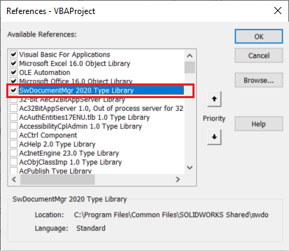
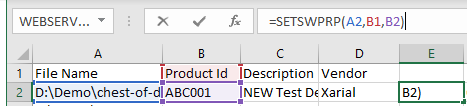
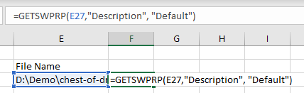
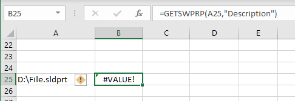
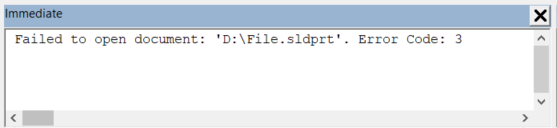

{ width=250 }

This Excel VBA macro adds additional functions to Excel palette allowing to read and write custom properties from SOLIDWORKS files.

This macro utilizes Document Manager which makes the process of reading and writing properties much faster (x10-x100+ times) than regular SOLIDWORKS API. 

Furthermore SOLIDWORKS installation is not required to use this macro.

## Preparation

* If you do not have Document Manager License key, follow [Activating Document Manager](/solidworks-document-manager-api/getting-started/create-connection#activating-document-manager) article for the steps required to retrieve the Document Manager license. This key is free for SOLIDWORKS customers under subscription.
* Create new excel document and create new macro. Paste the macro code below



* Modify the macro and enter the license key instead of the *<Your License Key>* placeholder, retrieved in the first step. Note, depending on the size of the key you may see *Compile error: Invalid outside procedure error* error. Follow [this article](/solidworks-api/troubleshooting/macros/too-long-vba-macro-line/) for a solution.

~~~ vb jagged-bottom
Const SW_DM_KEY As String = "<Your License Key>"
~~~

* Add the *SwDocumentMgr YEAR Type Library* reference to the macro.

## Usage

Macro will add 2 functions into the Excel functions scope which can be used as any other function in Excel

As standard functions user can pass the parameter as reference to other cells.

Or can use free text

When multiple properties need to be written or read, use Excel ranges to maximize the performance of the operation

### GETSWPRP

This function allows to extract the values of specified property from file or a given configuration

#### Parameters

* File Name - full path to SOLIDWORKS part, assembly or drawing
* Property Names - property or range of properties to read values from
* (Optional) Configuration Name - name of the configuration to read values from, if not specified properties are read from the general tab

### SETSWPRP

Writes properties to the specified SOLIDWORKS file into the specified configuration

#### Parameters

* File Name - full path to SOLIDWORKS part, assembly or drawing
* Property Names - property or range of properties to write values to
* Property Values - value or range of values of properties
* (Optional) Configuration Name - name of the configuration to write values to, if not specified properties are written to the general tab

## Troubleshooting

In case of an error the corresponding cell will indicate this:

To find more about the error. Open the macro and inspect immediate window output

> It is strongly recommended to test this macro on sample data before using on production file. And also it is strongly recommended to backup the data before using this macro.