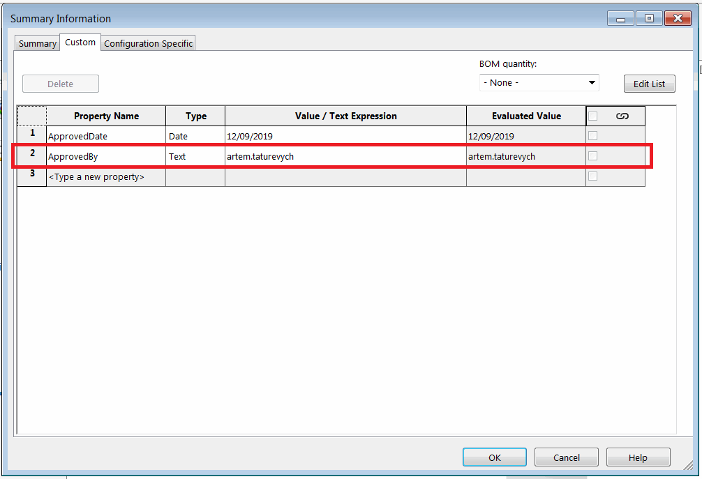

{ width=450 }

This VBA example demonstrates how to add the *ApprovedBy* property with the value of the name of current user to all sources using Document Manager API. Property will be added (or updated) for the file (general), all configurations and all cut-list items.

Specify the full path of the file in the *FILE_PATH* constant.

