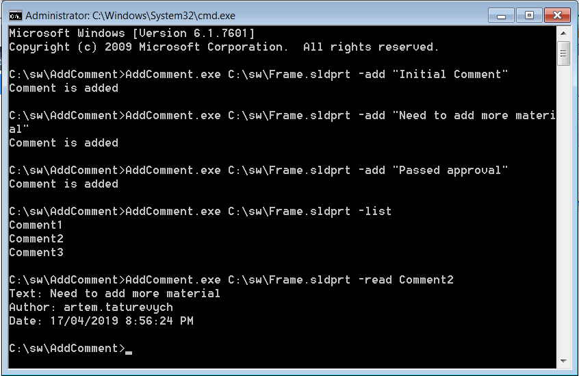

This example demonstrates how to store user text comments directly in the model 3rd party storage store using SOLIDWORKS Document Manager API.

Each comment is stored in the individual sub stream of 3rd party storage store. Specific comment can be accessed without the need of loading of all comments.

The program developed as a console application and has 3 modes

* Add new comment. Performed by adding the -add switch followed by comment content

~~~
AddWatermark.exe C:\MyFile.sldprt -add "Sample Comment"
~~~

* List all comments. Performed by adding the -list switch. This command loads the names of all comments without loading their contents.

~~~
AddWatermark.exe C:\MyFile.sldprt -list
~~~

* Read specific comment. Performed by adding the -read switch followed by comment name. In this case he comment information (text, author and date) is loaded and printed to the console.

~~~
AddWatermark.exe C:\MyFile.sldprt -read Comment3
~~~

{ width=450 }

### Program.cs

Routine to handle the command line parameters and perform corresponding operations.



### ComStorage.cs

Wrapper around [IStorage](https://docs.microsoft.com/en-us/windows/desktop/api/objidl/nn-objidl-istorage) interface which simplifies the access from .NET language



### ComStream.cs

Wrapper around [IStream](https://docs.microsoft.com/en-us/windows/desktop/api/objidl/nn-objidl-istream) interface which simplifies the access from .NET language


