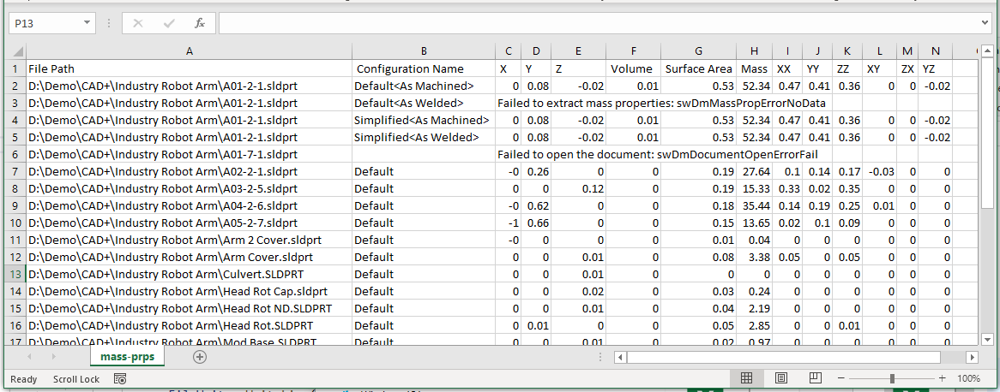

This C# code example demonstrates how to employ SOLIDWORKS Document Manager API to extract mass properties from all configurations of the files in the input directory.

Result is output to the specified CSV file with the following columns:

* File Path
* Configuration Name
* X coordinate of Center of gravity (m)
* Y coordinate of Center of gravity (m)
* Z coordinate of Center of gravity (m)
* Volume (m^3)
* Surface Area (m^2)
* Mass (kg)
* XX Moment Of Intertial (kg*m^2)
* YY Moment Of Intertial (kg*m^2)
* ZZ Moment Of Intertial (kg*m^2)
* XY Moment Of Intertial (kg*m^2)
* ZX Moment Of Intertial (kg*m^2)
* YZ Moment Of Intertial (kg*m^2)
 
> If there were any errors extracting the properties, this will be output to the CSV file

It is required to specify 3 command line parameters

1. Full path to an input directory
1. Fiilter for files
1. Full path to output CSV file

~~~
> export-mass-props.exe "D:\Input Folder" *.sldprt D:\mass-prps.csv
~~~

