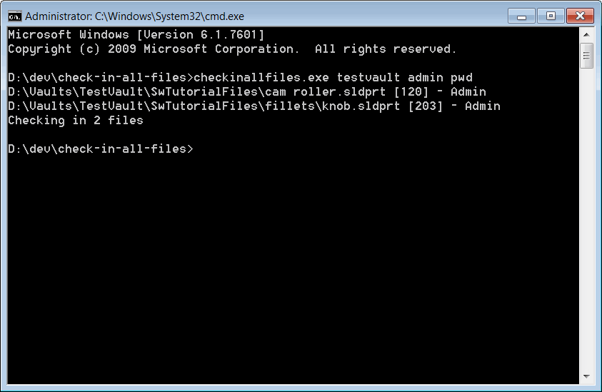

This VB.NET command line utility searches for all checked-out files in the specified SOLIDWORKS PDM Professional vault and checks them in.

Utility can be called from the command line and can be a part of the automation process (such as Windows Task Scheduler).

Utility expects 3 arguments to be specified:

* Vault Name
* User Name
* User Password

The list of files, ids and the locked by user information is displayed in the command line. Once script finishes execution, all files are checked-in. Any errors occurred during the execution are printed into the console window.

{ width=450 }


