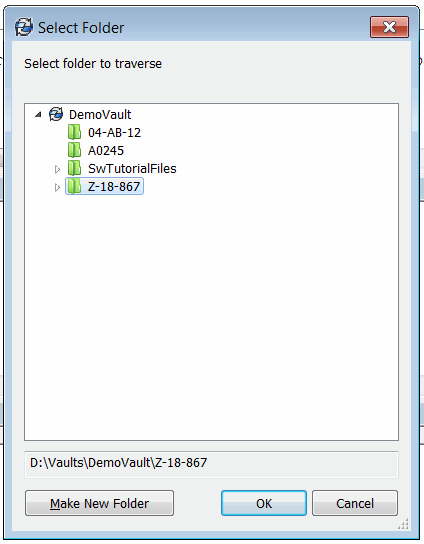
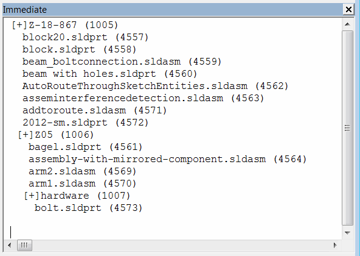

This VBA example demonstrates how to traverse files and folders in the SOLIDWORKS PDM vault using SOLIDWORKS PDM API.

Macro displays the built-in folder browse dialog for the folder to traverse:

{ width=250 }

Macro recursively traverses files and sub folders and outputs the file or folder name, id, level to the VBA Editor immediate window.

{ width=350 }

This macro can traverse the tree even if it is not [cached locally](/solidworks-pdm-api/files/local-cache/)


