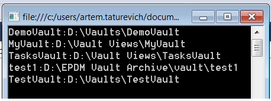

{ width=250 }

This example demonstrates how to list all available vault views and their paths and prints the information to the console window.

[IEdmVault8::GetVaultViews](https://help.solidworks.com/2018/english/api/epdmapi/epdm.interop.epdm~epdm.interop.epdm.iedmvault8~getvaultviews.html) SOLIDWORKS PDM API is used to list the information about all available PDM vaults. Alternatively this information can be retrieved from the Registry.


